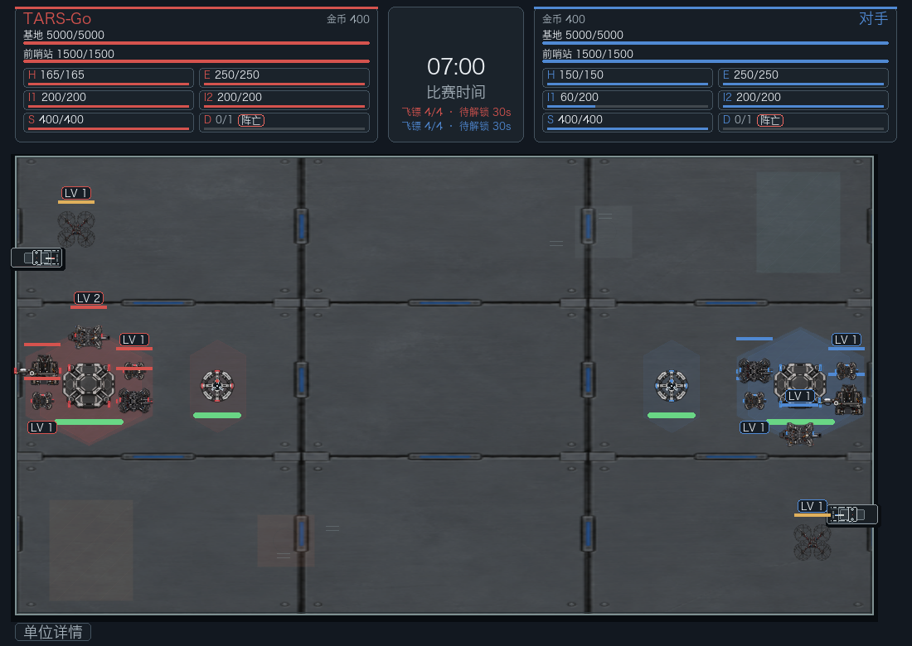
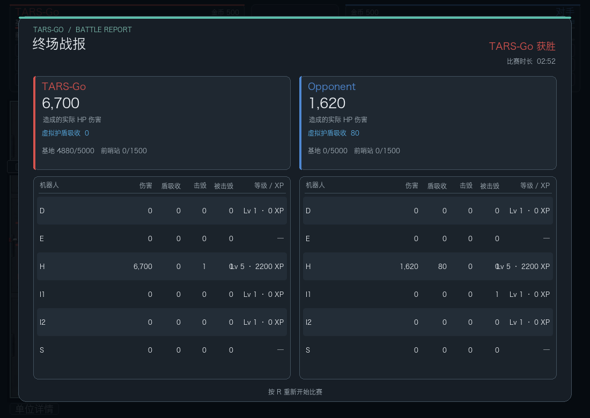

# Battle Statistics & Results

The match report is a presentation of facts already produced by the simulation.
It does not apply damage, infer kills from a final HP snapshot, or award
experience.

- **Damage dealt** is the actual HP removed recorded on `ROBOT_DAMAGED` and
  `STRUCTURE_DAMAGED` events. Defense, attack modifiers, overkill clamping and
  the D4 virtual shield have already been resolved by the ruleset.
- **Virtual shield absorption** is recorded separately on those events. It is
  not included in HP damage, the kill XP path, or the robot's HP-damage total.
- **Kills and deaths** come from `ROBOT_DESTROYED` events. A kill is credited
  only when that event names an opposing attacker robot; each destruction
  contributes one death, including repeated deaths after respawn.
- **Level and experience** come from the active ruleset's progression display
  state. Robots and modes without that state show no level or XP value.
- Team damage includes enemy HP damage credited to the attacking team, even
  when the source is a team-level action rather than an individual robot. The
  individual row is credited only when the combat event identifies that robot.

The report remains over the final match frame. Press **R** to restart; the new
match gets a fresh event ledger and zeroed statistics. No report data is stored
outside the current match.

## Pygame captures

These captures were rendered by the desktop Pygame renderer from a Rules Lab
match state. The live view shows rule-backed level tags; the result view uses
damage, destruction, and progression facts generated in that match.

