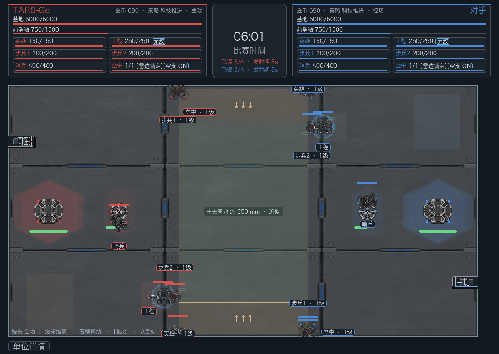
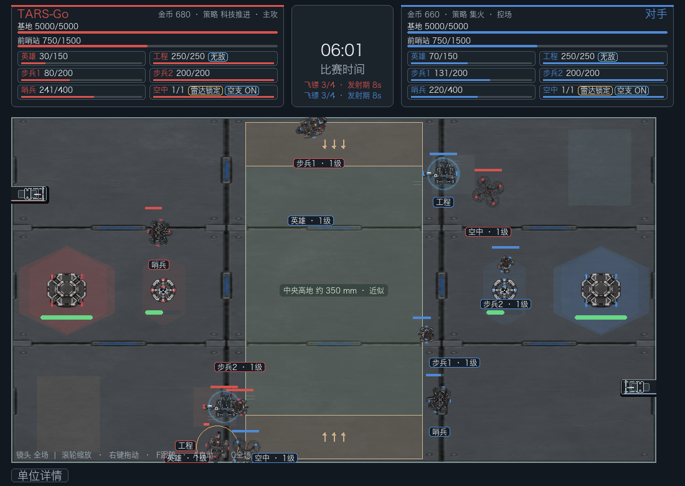

# RMUC 2026 spectator AI stall audit (420 s)

Both runs used the RMUC 2026 Rules Lab scenario, `rmuc_spectator_ai=True`, fixed 1/60 s match updates, and sampled every robot once per simulated second. The baseline is `8d186c506514e9988368465dfe400e22c676067d`. Each run advanced the full 420 simulated seconds without an early winner; the Rules Lab did not set `match.finished` during this diagnostic.

## Reproduced root cause

At the north ramp side, `can_traverse((10120.13, 300), (17853.58, 300))` accepted a 7,733 mm A* segment, while `can_traverse((10120.13, 300), (10151.80, 300))` rejected the first 31.67 mm frame step. `Robot.propose_movement` then returned the original position with an empty path. `_move_robots` saw no intended movement, so it recorded no block and did not start stuck recovery. Red infantry 1 remained at `(10120, 300)` for 407.5 s; mirrored blue infantry 1 remained at `(17856, 14700)` for 407.4 s.

A second A* failure occurred when the real start was traversable but its 200 mm grid-cell center was not. From `(17817.7, 578)` to the blue supply goal `(25076, 1268)`, the nearest center `(17900, 500)` was not traversable, and the search returned no route despite a valid connector through `(17700, 500)`. The updated search uses that nearby connector only when the normal cell-center connector is blocked.

## 7-minute run comparison

| Metric | Baseline | After fix |
|---|---:|---:|
| Simulated time | 420 s | 420 s |
| Wall time | 142.32 s | 62.53 s |
| Sim seconds / wall second | 2.95 | 6.72 |
| Path requests / searches started | 4373 / 1304 | 3822 / 695 |
| Search failures | 1078 | 81 |
| Node expansions | 10,946,528 | 1,422,206 |
| Peak queued path jobs | 10 | 10 |
| Stuck-recovery attempts / successes | 158 / 2 | 690 / 7 |
| 600-frame Pygame sample, 60 Hz cap | 57.01 fps | 55.00 fps |

The frame-rate sample used a Pygame display under SDL's dummy video driver on the same machine. Its measured rate was 3.5% lower after the fix; this is a short headless presentation sample, not a hardware desktop FPS measurement. The 420-second runs used fixed 60 Hz match updates, and their wall times are headless diagnostic rates. The fixed run still records combat knockouts, power-limited waits, and intentional engineer/sentry holds. Those appear separately in the per-robot table; they are not counted as terrain path failures. The path queue remained bounded at 10 jobs.

## Baseline robot telemetry at 420 s

| Robot | Position mm | Target and AI intention | Path status / length | Pending / queued | Can move; observed block | Still now / longest |
|---|---|---|---|---|---|---|
| tarsgo-hero | (10128, 14700) | structure:blue-base —；进攻基地 | searching / 0 个点 / 0 mm | 2 / 2 | True；no route: attack/hold/support decision or path pending/cleared | 378.4 / 378.4 s |
| tarsgo-engineer | (3194, 13050) | zone:supply:red —；后方待命 | none / 0 个点 / 0 mm | 0 / 0 | True；no route: attack/hold/support decision or path pending/cleared | 231.2 / 231.3 s |
| tarsgo-infantry-1 | (10120, 300) | robot:opponent-hero (17854, 300)；追击敌方英雄 | none / 0 个点 / 0 mm | 0 / 0 | True；no route: attack/hold/support decision or path pending/cleared | 407.6 / 407.5 s |
| tarsgo-infantry-2 | (8993, 14655) | robot:opponent-infantry-1 (17856, 14700)；追击敌方步兵 | active / 3 个点 / 8952 mm | 0 / 0 | False；can_move=false: power_off=3.300000000000003 blocked=True | 1.7 / 54.8 s |
| tarsgo-sentry | (2925, 12164) | zone:fortress:red —；占领堡垒 | none / 0 个点 / 0 mm | 0 / 0 | True；no route: attack/hold/support decision or path pending/cleared | 168.8 / 190.1 s |
| tarsgo-drone | (10124, 300) | robot:opponent-engineer (24806, 1950)；空中压制敌方工程 | none / 0 个点 / 0 mm | 0 / 0 | True；no route: attack/hold/support decision or path pending/cleared | 414.9 / 414.9 s |
| opponent-hero | (17854, 300) | structure:red-base —；进攻基地 | searching / 0 个点 / 0 mm | 2 / 2 | True；no route: attack/hold/support decision or path pending/cleared | 403.6 / 403.6 s |
| opponent-engineer | (24806, 1950) | zone:supply:blue —；后方待命 | none / 0 个点 / 0 mm | 0 / 0 | True；no route: attack/hold/support decision or path pending/cleared | 226.4 / 226.4 s |
| opponent-infantry-1 | (17856, 14700) | robot:tarsgo-hero (10128, 14700)；追击敌方英雄 | none / 0 个点 / 0 mm | 0 / 0 | True；no route: attack/hold/support decision or path pending/cleared | 407.4 / 407.4 s |
| opponent-infantry-2 | (18217, 263) | zone:central:blue (17188, 8960)；前往中央区域 | active / 2 个点 / 9578 mm | 0 / 0 | True；robot collision/yield: opponent-hero | 191.4 / 191.4 s |
| opponent-sentry | (25075, 2836) | zone:fortress:blue —；占领堡垒 | none / 0 个点 / 0 mm | 0 / 0 | True；no route: attack/hold/support decision or path pending/cleared | 168.3 / 203.5 s |
| opponent-drone | (17876, 14700) | robot:tarsgo-engineer (3194, 13050)；空中压制敌方工程 | none / 0 个点 / 0 mm | 0 / 0 | True；no route: attack/hold/support decision or path pending/cleared | 414.6 / 414.5 s |

## Fixed robot telemetry at 420 s

| Robot | Position mm | Target and AI intention | Path status / length | Pending / queued | Can move; observed block | Still now / longest |
|---|---|---|---|---|---|---|
| tarsgo-hero | (4984, 13552) | — —；等待复活 | none / 0 个点 / 0 mm | 0 / 0 | False；dead/respawn or drone paused | 35.0 / 36.0 s |
| tarsgo-engineer | (3194, 13050) | zone:supply:red —；后方待命 | none / 0 个点 / 0 mm | 0 / 0 | True；no route: attack/hold/support decision or path pending/cleared | 231.2 / 231.3 s |
| tarsgo-infantry-1 | (13341, 261) | — —；等待复活 | none / 0 个点 / 0 mm | 0 / 0 | False；dead/respawn or drone paused | 387.3 / 387.3 s |
| tarsgo-infantry-2 | (3195, 12164) | zone:fortress:red —；占领堡垒 | none / 0 个点 / 0 mm | 0 / 0 | True；no route: attack/hold/support decision or path pending/cleared | 3.0 / 29.0 s |
| tarsgo-sentry | (10536, 14133) | zone:supply:red (2600, 13732)；回撤补给 | active / 2 个点 / 8175 mm | 0 / 0 | True；— | 0.0 / 46.1 s |
| tarsgo-drone | (12578, 500) | robot:opponent-engineer (24806, 1950)；空中压制敌方工程 | active / 2 个点 / 13775 mm | 0 / 0 | True；— | 0.0 / 30.8 s |
| opponent-hero | (12989, 402) | — —；等待复活 | none / 0 个点 / 0 mm | 0 / 0 | False；dead/respawn or drone paused | 387.3 / 387.3 s |
| opponent-engineer | (24806, 1950) | zone:supply:blue —；后方待命 | none / 0 个点 / 0 mm | 0 / 0 | True；no route: attack/hold/support decision or path pending/cleared | 226.4 / 226.4 s |
| opponent-infantry-1 | (10121, 14425) | — —；等待复活 | none / 0 个点 / 0 mm | 0 / 0 | False；dead/respawn or drone paused | 345.2 / 345.2 s |
| opponent-infantry-2 | (19234, 660) | zone:supply:blue (25076, 1268)；前往补给区 | active / 1 个点 / 5873 mm | 0 / 0 | True；— | 0.0 / 36.2 s |
| opponent-sentry | (17905, 14425) | robot:tarsgo-sentry (10860, 13626)；集火残血目标 | active / 2 个点 / 7114 mm | 0 / 0 | False；can_move=false: power_off=4.400000000000002 blocked=True | 0.6 / 141.9 s |
| opponent-drone | (10765, 13027) | robot:tarsgo-sentry —；空中压制残血目标 | none / 0 个点 / 0 mm | 0 / 0 | True；no route: attack/hold/support decision or path pending/cleared | 18.0 / 265.1 s |

## Pygame comparison

The before and after images use the actual Pygame observer draw path after 60 simulated seconds at 60 Hz. Before, both mirrored infantry are stopped at opposite ramp edges; after, both have left those edge positions and continue through the match.

