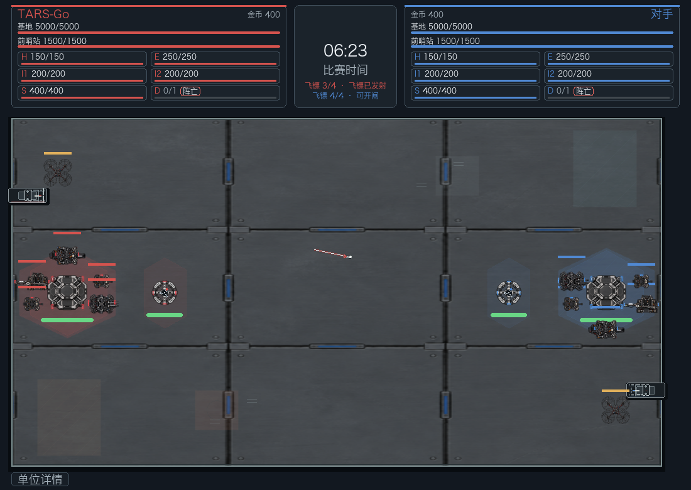
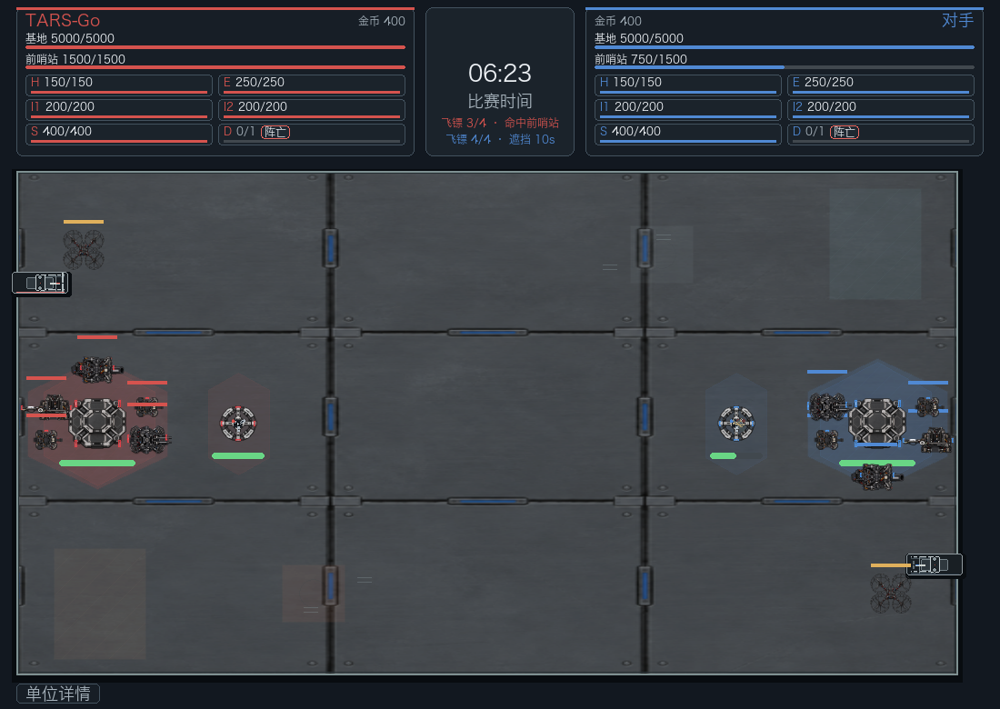
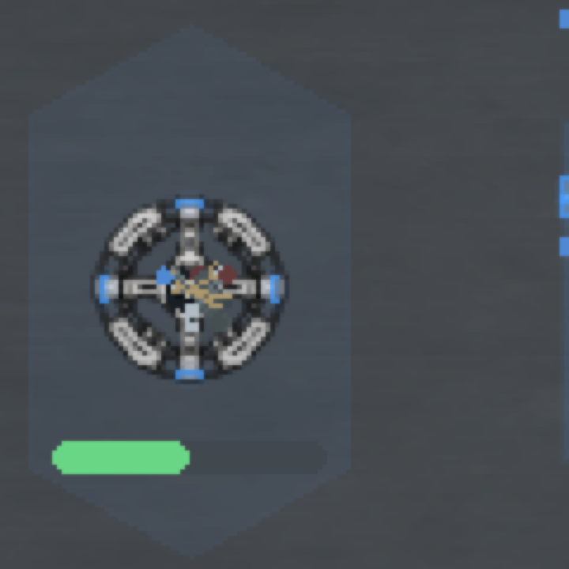

# PR #75 — Dart presentation and impact-particle measurements

## Scope

The Dart launcher, projectile, trail, and impact feedback are presentation-only. A launch visual follows the existing Dart ammunition/status change; a hit or miss follows the existing referee result. The visual layer does not resolve hits or change damage, collision, AI, or field geometry.

The field drawing in RMUC 2026 V1.4.0 Figures 4-4 and 4-5 was checked for the launch stations and their facing. Figure 4-4 shows the two stations at opposite short ends; Figure 4-5 says the launcher faces parallel to the field's long edge. The drawn stations are art-only anchors because the drawing does not provide confirmed map coordinates. They are not map structures and are not used by collision, LOS, or rules.

## 1100×780 frame pacing

Runs used the `rmuc-2026-region-rules-lab.yaml` scenario, 60 Hz target, 3600 rendered frames, and the existing `benchmark_rmuc_frame_pacing.py` instrumentation. Frame interval/work percentiles use the 3480 samples after the 120-frame warm-up. The base run was captured on `a84fe62ced0309269a577131b114b7090452b046` before this PR. The normal run includes ordinary simulation and AI. The stress run forcibly draws the maximum 384 Dart impact particles on every frame; it does not change gameplay state.

| Measurement | Base | Normal after | 384-particle stress |
| --- | ---: | ---: | ---: |
| Frame interval p95 / p99 / max | 17 / 18 / 21 ms | 18 / 19 / 19 ms | 18 / 19 / 19 ms |
| Frame work p95 / p99 / max | 9 / 11 / 21 ms | 9 / 12 / 16 ms | 10 / 13 / 17 ms |
| Render p95 / p99 | 4.068 / 4.219 ms | 4.179 / 4.331 ms | 4.431 / 4.567 ms |
| Update p95 / p99 | 4.604 / 5.287 ms | 4.442 / 4.998 ms | 4.609 / 5.296 ms |
| AI p95 / p99 | 0.269 / 0.322 ms | 0.258 / 0.291 ms | 0.266 / 0.314 ms |
| A* slice p95 / p99 | — | 0.143 / 0.212 ms | 0.146 / 0.222 ms |

Neither after-run recorded a frame interval above 20 ms (or 25/33 ms). At the full particle budget, render p99 increased by 0.236 ms over the normal run and frame interval p99 did not change. The normal asset-transform cache remained at 99.1% hits. The longest `render_draw` sample is a cold-start/cache-build outlier (175 ms normal, 173 ms stress); steady-state p95/p99 are shown above.

Completed A* search CPU time remains around 64 ms p95 / 71 ms p99 over the life of a search, while each budgeted slice stays below 0.23 ms at p99. This is distributed work rather than a single-frame stall.

## Rule-driven visual sequence

These 1100×780 captures come from the real RMUC rules-lab match and existing Dart rule API. The hit frame also shows the blue Outpost at 750/1500 HP and the existing “命中前哨站” status.

### Launcher, after rule-reported launch

### In flight

### Referee-recorded hit

