# PR #85 — RMUC 机器人视觉保真审计

审计基线：`main 123713539f25a5487537baa007d1336af53c552c`（PR #84 合并后的稳定版）。

本轮范围仅限 presentation 与 assets。PNG 源素材继续使用项目已有的 V2 文件；没有改规则、HP、碰撞尺寸、AI、导航、弹丸物理、场地坐标或观战镜头。

## 素材审计

Alpha 覆盖率由原始 RGBA PNG 逐像素统计。`alpha > 0` 包含柔边像素，`alpha ≥ 128` 统计有效主体像素。有效边界使用半开坐标 `[左, 上)–[右, 下)`。透明边距以 `左/上/右/下` 顺序记录。

| 机器人图层 | 原始尺寸 | alpha > 0 | alpha ≥ 128 | 有效边界 | 透明边距 |
|---|---:|---:|---:|---|---:|
| Infantry chassis | 1430×1100 | 49.64% | 47.56% | (105, 3)–(1400, 1090) | 105/3/30/10 |
| Infantry turret | 1536×1024 | 32.12% | 30.58% | (65, 8)–(1522, 1024) | 65/8/14/0 |
| Sentry chassis | 1536×1024 | 48.21% | 39.46% | (0, 10)–(1522, 1024) | 0/10/14/0 |
| Sentry turret | 1635×962 | 29.88% | 28.70% | (337, 37)–(1632, 920) | 337/37/3/42 |
| Engineer | 1536×1024 | 37.47% | 36.03% | (0, 35)–(1468, 1024) | 0/35/68/0 |
| Drone | 1254×1254 | 62.00% | 30.73% | (0, 0)–(1248, 1254) | 0/0/6/0 |

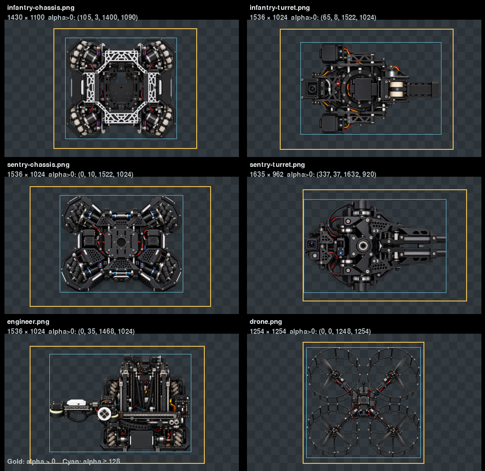

四类素材的原始采样密度足够。Infantry 底盘可辨四个麦克纳姆轮组、外露电机和 CNC 横梁；分离的云台素材包含传感器、摩擦轮和发射口。Sentry 底盘保持开放式四轮框架，独立云台包含传感器和双发射轨。Engineer 保留开放式底盘、升降组件与伸向一侧的机械臂；没有闭合装甲外壳。Drone 显示四个带网罩的旋翼、机臂与中央机身。四种素材均保留，无需新增或重绘 PNG。

除云台覆盖面积外，各图层 alpha 质心与画布中心的差值在实际显示尺寸下不超过约 1.1 px。底盘和云台继续以同一 Pygame 屏幕中心绘制，独立角度继续通过原有 `body_angle` / `turret_angle` 传入。

### 第一批：Infantry 与 Sentry

基线在全场、2.6×和 3.6×下显示清楚，但近景的 Infantry 与 Sentry 云台 footprint 会压住较多底盘像素。测量在 Pygame 生产变换路径输出的最大合理 3.6×尺寸上进行，使用 alpha≥128 mask；每种机器人采样 4 个底盘角度 × 4 个云台角度，统计先画底盘、再画云台后的底盘可见比例。表中区间表示这 16 组姿态的最小值与最大值。

| 机器人 | 基线显示尺寸（底盘 / 云台） | 底盘可见均值 | 新显示尺寸（底盘 / 云台） | 新底盘可见均值 |
|---|---:|---:|---:|---:|
| Infantry | 34×26 / 42×28 | 31.5% (28.5–35.3%) | 34×26 / 34×23 | 49.7% (47.9–53.9%) |
| Sentry | 58×38 / 68×40 | 31.9% (26.8–40.4%) | 58×38 / 56×33 | 46.9% (43.0–54.2%) |

Infantry 云台保留与素材接近的 1.48 宽高比，显示宽度改为与底盘相同；Sentry 云台按自己的 1.70 素材比例收窄并降低高度。两者没有照搬 Hero 的比例。云台图仍完整显示，底盘尺寸与碰撞几何不变。

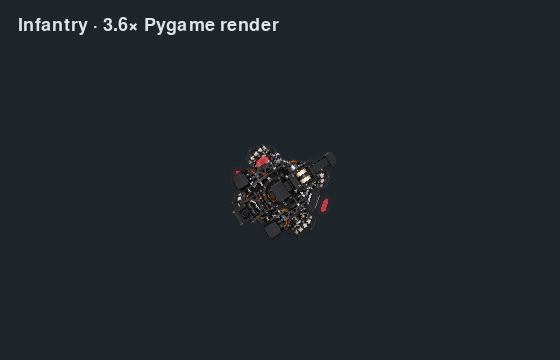
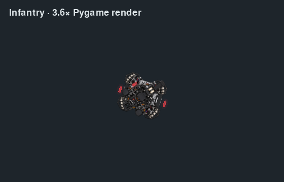

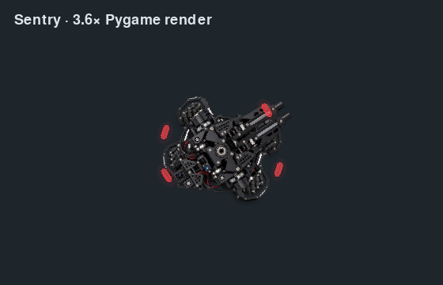
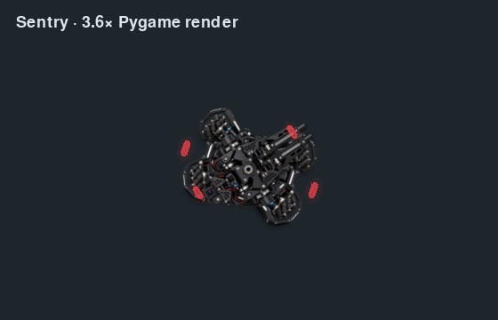

全场画面来自同一 `Match` 场景和普通视角；局部画面使用相同的渲染场景与 2.6×镜头；最大画面使用同一场景与 #83 支持的 3.6×上限。近景直接调用生产 `_draw_rmuc_robot_shape`，倍率同为 3.6×。前后两侧使用相同位置、姿态、倍率、动画时刻和 Pygame 路径。

| 验收视图 | 修改前 | 修改后 |
|---|---|---|
| 全场 | 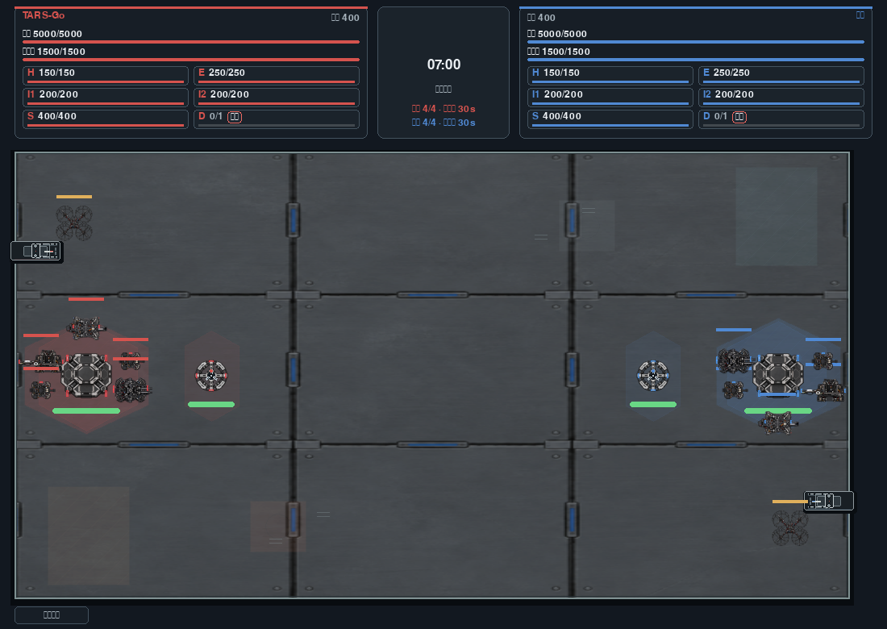 | 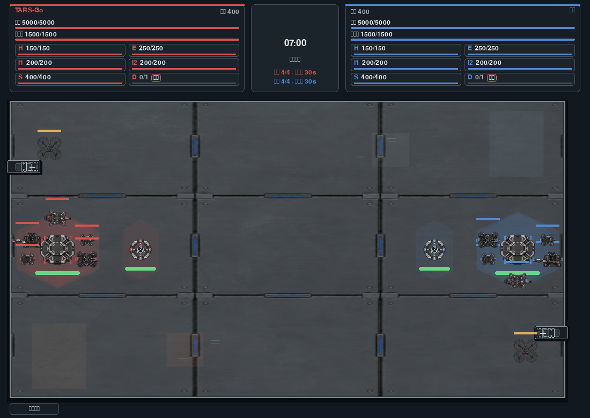 |
| Infantry 普通局部 | 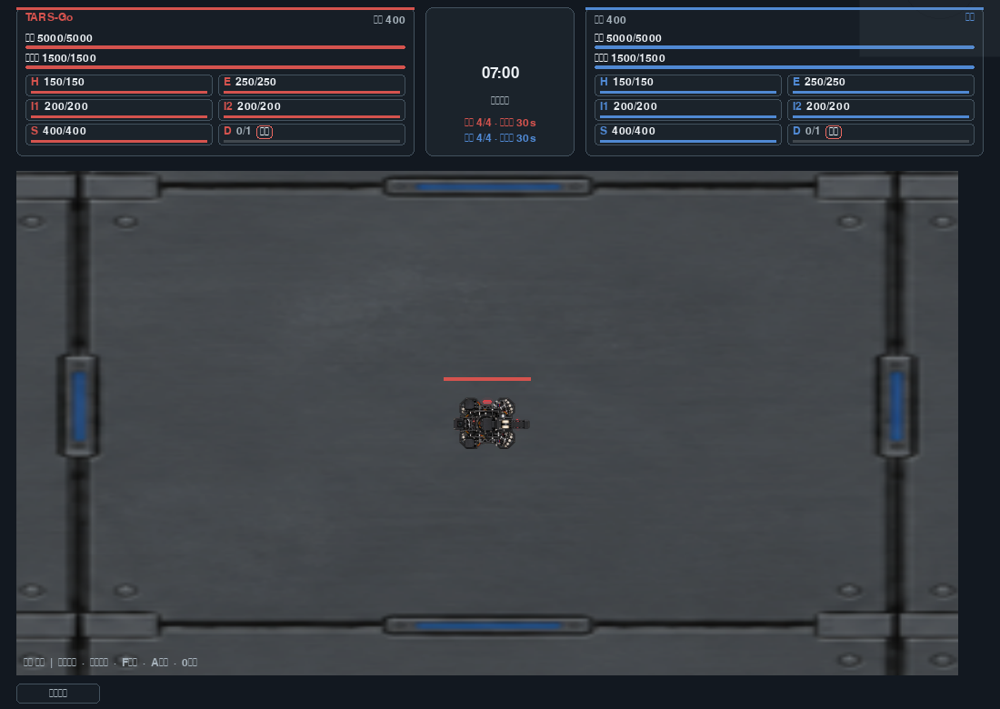 | 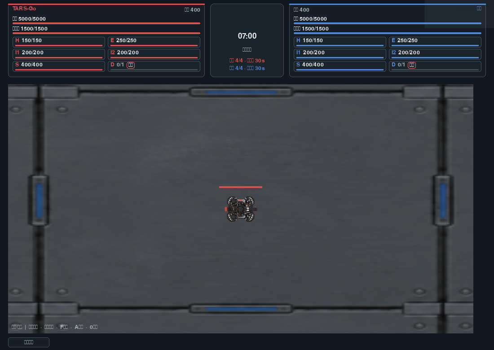 |
| Infantry 最大合理缩放 3.6× | 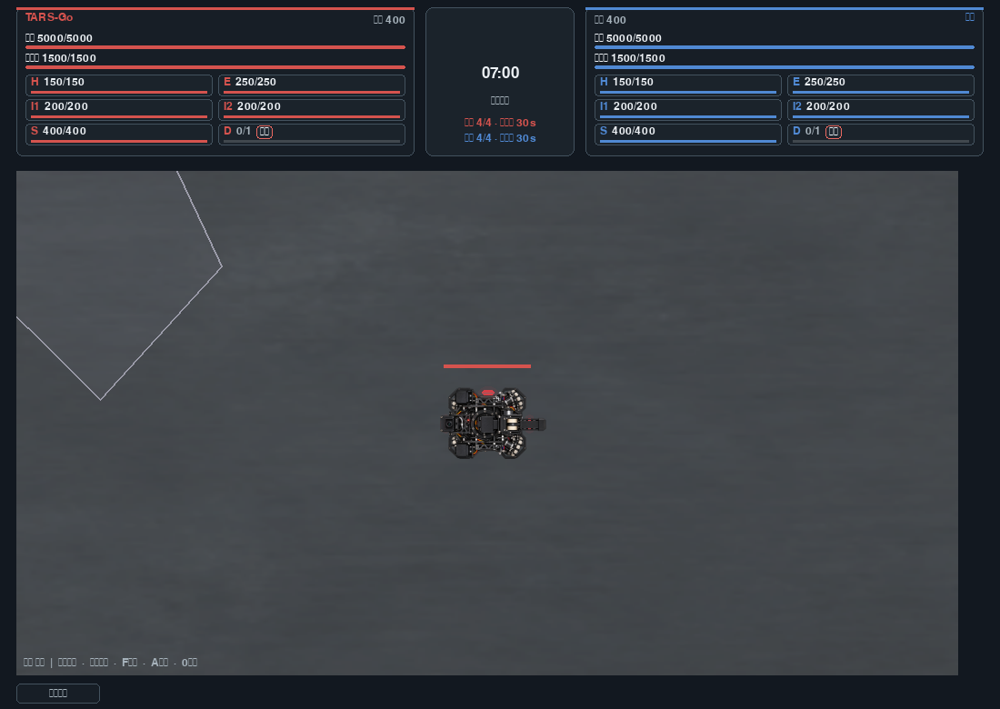 |  |
| Sentry 普通局部 |  | 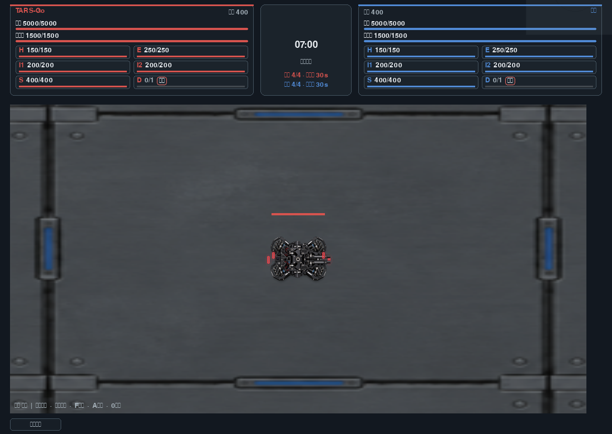 |
| Sentry 最大合理缩放 3.6× |  | 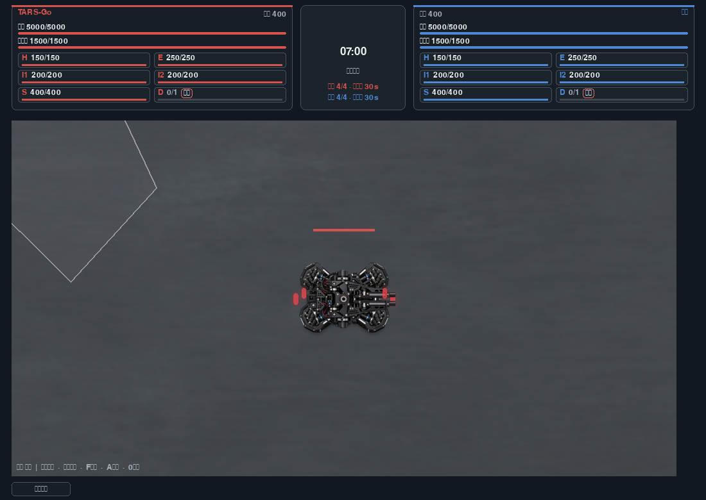 |

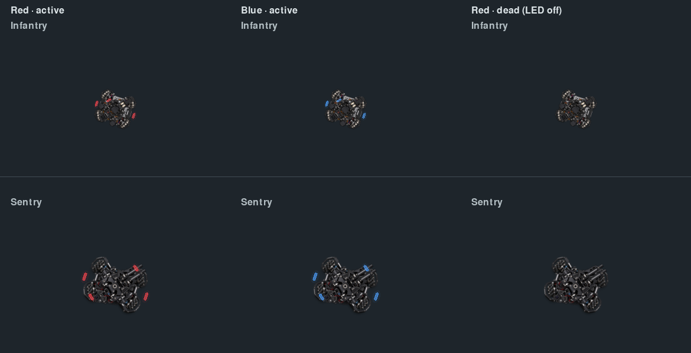

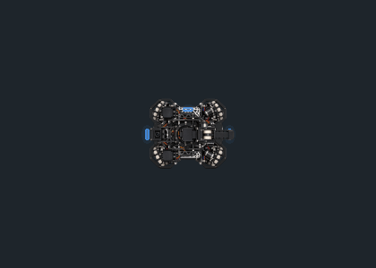

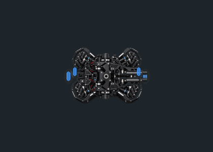

### 第二批：Engineer 与 Drone

素材审计结论：Engineer 的机械臂、升降轨和四组轮子清楚，保持现有开放式结构；Drone 的旋翼网罩、机臂和机身清楚，已有轻微上下悬停和死亡状态熄灯。两张 PNG 暂不重绘。第二批的显示尺寸与旋转策略、相同镜头下前后截图、动态证据和状态展示将在第二阶段验收后补入本报告。

## 来源与许可

所有机器人 PNG 均为仓库已有的原始项目素材，2026-10-07 使用内置图像生成工具制作，并以用户真实机器人照片作为仅供结构参考的私有参考图；参考照片未加入仓库或随游戏分发。未使用第三方或网络图片。资产来源与 MIT 许可记录见 [`assets/rmuc/robots/README.md`](../assets/rmuc/robots/README.md)。本轮没有新增美术素材；新增截图和 GIF 均由 Pygame 游戏渲染路径生成。

## 质量边界

普通全场视角中细小螺丝和传动纹理仍会受显示像素限制；本轮不通过增大机器人或改变地图镜头掩盖该限制。基线已经满足要求的 Hero 未改动。全量测试及两批完成后的最终性能结果见 [`docs/performance/pr85-robot-visual-fidelity.md`](performance/pr85-robot-visual-fidelity.md)。
