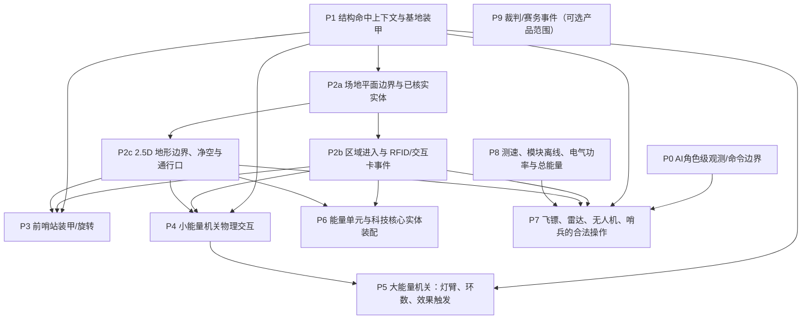

# RMUC 2026 V1.4.0 Full Rule Coverage Audit

> **唯一规则覆盖矩阵。** Issue [#85](https://github.com/Tyr1onX/tarsgo-simulator/issues/85) 的规则状态、来源、测试、缺口和优先级以本文为准。旧的 `rmuc-2026-gap.md` 仅保留此文档入口。

- 仓库基线：`main=85f1bf864d901960219933826800bebbebb454f5`（PR #88 合并后）；测试基线 **1127 passed, 1 skipped**，Windows/macOS build 均通过。
- 审计规则版本：RMUC 2026 区域赛规则手册 V1.4.0，发布日期 2026-03-20
- 官方原文：[V1.4.0 PDF](<https://bbs-web-static.robomaster.com/38afa6d7914345f7bb5d496692fd429b1773977681621/RoboMaster%202026%20%E6%9C%BA%E7%94%B2%E5%A4%A7%E5%B8%88%E8%B6%85%E7%BA%A7%E5%AF%B9%E6%8A%97%E8%B5%9B%E6%AF%94%E8%B5%9B%E8%A7%84%E5%88%99%E6%89%8B%E5%86%8CV1.4.0%EF%BC%8820260320%EF%BC%89.pdf>)；[官方规则文档索引](https://bbs.robomaster.com/wiki/20204847/809871?source=7)
- 本地审计副本 SHA-256：`fadf6096d486b31a740d846b79388e934696da409b57076bbc09d680e022d3da`（158页）
- 以上是本次P2a开始时的稳定main基线；PR分支的CI结果以本PR检查为准。
- 范围：§3–§9、规范性附录1–2和附录3的排除说明；仅核对V1.4.0，不把后续版本差异套用到本审计。
- 审计方式：按“规则文本 → 状态/数值消费者 → 实际场上触发/碰撞 → AI可合法操作 → 可观察结果 → 自动测试”追踪。源码与现有测试是静态检查；本审计没有本地运行测试。引用的测试代表仓库已有自动化覆盖，不代表每行均有端到端比赛测试。
- Issue #85 的全部正文和两条补充评论已纳入范围，特别校正了评论指出的过期“物理弹丸/装甲未实现”描述：这些能力已有一部分，但对结构面板、旋转装甲及能量机关仍不构成完整场上规则实现。

## 判定口径

| 状态 | 含义 |
|---|---|
| 完整 | 该行所列V1.4.0边界在当前规则状态逻辑中实现，且源码/自动测试支持。只对明确限定的边界给“完整”。 |
| 部分 | 有真实规则状态/数值消费者或部分触发路径，但核心条件、实体交互、合法输入或边界仍缺。 |
| 未实现 | 未发现相应规则消费者或可玩交互路径。 |
| 错误 | 现有行为会给出与V1.4.0不同或具误导性的模拟结果；刻意标注为近似仍不等于规则覆盖。 |
| 范围外 | 规则要求真实裁判、硬件、人工操作或赛事工作流，而当前产品是桌面 Rules Lab。不是“已实现”。 |
| 不适用 | 非规范内容，或该行不要求该覆盖轴。 |

“规则状态逻辑”只评价规则层；“场上交互”要求机器人/弹丸/场地实体能够真正触发规则，不把测试直接设置字段、裁判确认API或HUD计时器算作实体交互；“AI合法使用”要求角色有权限且只使用当时合法可见的信息。优先级：P0为后续机制前置的AI信息边界；P1为本轮后第一项机制 PR；P2–P7为依赖序列。

## 覆盖摘要

下表对38个审计单元按三个轴分别计数，不把三轴混成一个“总体完成率”。范围外和不适用保留在分母说明中，不能当成实现覆盖。

| 覆盖轴 | 完整 | 部分 | 未实现 | 错误 | 范围外 | 不适用 |
|---|---:|---:|---:|---:|---:|---:|
| 规则状态逻辑 | 1 | 26 | 5 | 0 | 4 | 2 |
| 场上交互 | 0 | 18 | 10 | 1 | 6 | 3 |
| AI合法使用 | 0 | 19 | 9 | 2 | 1 | 7 |

**关键结论：** 当前拥有较多受测的规则状态消费者（回血/复活、金币/经验、护盾/增益、堡垒和科技核心）；但多项正式机制只有裁判/测试直接传入确认结果。场上交互整体明显低于规则状态逻辑；AI具备合成场地上的战术行为，但还没有合法信息边界。尤其：
- **基地护甲：** P1 将既有 `base_armor_deployed` 状态接入投射物面板碰撞，并补上六面命中上下文、基地17mm/42mm模块伤害和中心区攻击乘数。基地部署几何与10×10mm中心区在俯视2D场中仍有显式投影假设；前哨站模块/中心区和AI瞄准仍未闭环。
- **前哨站：** HP、摧毁、重建机会/占点规则有逻辑与测试；中部装甲的旋转在 `desktop.visuals.OutpostRotorVisualState` 是展示层状态，不参与投射物碰撞，也没有完整同步双方的每局旋转方向。
- **小/大能量机关：** 效果公式、时限和经验等结果消费者有专门测试；灯臂/灯板、目标运动、击中时序/环数、操作员触发与AI发令都没有实际场上路径。
- **AI：** 当前AI测试证明策略稳定和可复现，不证明符合官方传感器/操作手权限。AI共享完整 `Match` 状态；至少雷达和目标选择可读对手隐藏位置/HP。后续任何AI规则合规声明都应建立在角色级观察与动作API之上。

## 唯一覆盖矩阵

源码路径相对于仓库根目录；测试引用为现有测试文件。矩阵中的“规则状态逻辑/场上交互/AI合法使用”分别判级。

### 子规则与暂缓决策追踪

38行是**主题级覆盖矩阵**，不表示每行跨越的所有子规则都已独立完成验收。为避免压缩矩阵时丢失边界与暂缓理由，旧 gap 中的所有细分条目及决策说明已原文保存在[基线历史细分清单](archive/rmuc-2026-gap-pre-audit-f33113f.md)。其中旧的状态判断可能已经过期；当前覆盖状态以本矩阵为准，历史记录用于追踪原子规则和当时为何暂缓。

旧清单的每个章节/条目组均映射回本矩阵的主题行：

| 保留的旧清单章节 | 矩阵行 | 追踪范围 |
|---|---|---|
| Implemented | R01、R03–R07、R09–R10、R13–R19、R21–R29、R31 | 旧清单记录的已落地规则消费者、数值、来源路径、特殊状态和边界 |
| Intentionally not implemented（主清单） | R02–R08、R11–R12、R16、R20–R30、R33–R36 | 旧清单逐项暂缓的实体、源事件、物理过程及产品边界 |
| Unknown-source Experience | R16 | 未知/不可获经验来源、伤害/击杀分配与事件分类 |
| Tech Core D4 physical/field boundary | R22 | 真实核心姿态/动作、遮挡、超载、失败奖励与工程师控制 |
| Energy Unit / Tech Core physical boundary | R22 | 能量单元实体、携带/库存、空间位置和D1–D4物理装配 |
| Dynamic Power / Heat gameplay | R09–R10、R27、R30 | 性能表消费者、缓冲功率、冷却候选、附属状态与总能量差距 |
| Direct-damage boundary | R03–R06、R28 | 弹道近似、冲击条件、结构面板和飞镖接触 |
| Field boundary | R02、R17–R19、R22 | 合成场地、静态/地形/堡垒/装配交互区近似 |
| Next candidate | P0–P9 | 原计划的候选方向，已在下方重排为依赖顺序 |

旧清单各条目是追踪索引，不会把主题行中的“部分”扩展解释为所有子规则均已覆盖。每个后续机制 PR 都必须先把所属主题拆成具体V1.4.0子规则，并逐项列出规则章节/表格/图、边界条件、真实源码消费者、直接触发路径、自动测试及暂缓理由；未完成子项必须继续显式标为未实现/暂缓。

| ID | 规则范围/页码 | 审计行为与边界 | 规则状态逻辑 | 场上交互 | AI合法使用 | 源码、现有测试、证据与缺口/优先级 |
|---|---|---|---|---|---|---|
| R01 | §3 机器人、操作手与上场约束（pp.21–30） | 编制、类型属性、弹种/功率上限与操作手资格 | 部分 | 部分 | 部分 | `core.match.Match.reset`、机器人配置、`rules.rmuc_2026_region`；`tests/test_rmuc_2026_region.py`。模型化了主要地面机器人、无人机和哨兵配置；人员、开赛队伍检查及完整操作手约束不在模拟输入中。 |
| R02 | §4 场地与实体（pp.31–67） | 28×15m全场与外围钢围挡、模块定位、基地/前哨站、地形/通行层、资源区与飞行区 | 部分 | 部分 | 部分 | `configs/fields/rmuc-2026-v1.4.0.yaml`、`core.map.GameMap`、`core.projectiles._first_collision`、`desktop.app._draw_rmuc_battlefield`；`tests/test_rmuc_field_collision.py`、`tests/test_rmuc_terrain_topology.py`。§4.1/Fig4-5给28,000×15,000mm场地、上沿距地2,400mm的黑色钢围挡、长边向两侧1°–2°倾斜及部分木结构/地面交线可能有约50mm回收槽；同一平面范围用于地面移动、A*、弹丸边界、视线端点和渲染，模型不含墙高/坡度/槽位。Fig4-9 Base底座外轮廓与Fig4-33 Outpost主体Ø550mm已成为共享实体足迹；红蓝结构180°对称。Fig4-25/26/27/28/29/34/36/37给出局部模块尺寸/坡度（如堡垒约1120×1939mm及20°坡、梯形高地200–400mm高且含43°/23°坡、中央高地约7700×10820mm及10.5°坡、公路11°/15°坡、起伏凸起240×70mm、飞坡17°），但§4.1允许现场细节调整，图纸未给所有模块可直接组合的全场XY边界、竖直面/净空和通行口。内场坡道/桥/隧道/凸起未进入碰撞：当前A*和弹丸/视线只避开结构及`obstacles`；RMUC YAML仍为`obstacles: []`，故扁平投影中机器人路径/射线可跨越未建模地形。不会以插图像素猜测障碍；内部地形与飞行区、实体能量单元/场地卡仍缺。 |
| R03 | §5.1.1–5.1.2 弹种/测速与 Rules Lab 仿真射击节奏 | 官方规定弹种/发射机构约束、有效命中速度阈值和测速限制；V1.4.0 未定义通用逐发射击间隔。仓库17mm 0.05s、42mm 0.50s来自 `lab_projectile_physics.simulator_approximation`，是 Rules Lab 射击节奏假设，不是官方规则 | 部分 | 部分 | 部分 | `configs/rules/rmuc-2026-region-v1.4.0.yaml` 的注释与 `lab_projectile_physics`；`core.projectiles.ProjectileSystem.advance`、`_first_collision`；`tests/test_rmuc_physical_projectiles.py`、`tests/test_rmuc_structure_projectile_hits.py`。机器人装甲维持2D接触近似；基地结构现携带面板、表面冲击点、弹种和有效法向速度，17/42mm结构阈值边界有真实弹丸测试。官方测速锁定/弹速衰减不全。仿真节奏仍只是假设，不计为官方规则缺口。 |
| R04 | §5.1.1 机器人、基地、前哨站原始伤害 | 按弹种/目标表格结算；基地17mm上方前装甲模块与其它装甲不同，飞镖检测模块单列 | 部分 | 部分 | 部分 | `core.match.Match.apply_damage`、`rules.rmuc_2026_region.resolve_structure_projectile_hit`、`core.projectiles._structure_contact`；`tests/test_rmuc_physical_projectiles.py`、`tests/test_rmuc_structure_projectile_hits.py`。基地真实命中上方前装甲17mm=5、其余五块=20、42mm=200，并复用Attack/Defense结算；机器人装甲已有多个hitbox。前哨站旋转模块仍按整结构footprint接触，检测模块/飞镖规则另行处理，未在P1补齐。 |
| R05 | §5.5.1 基地护甲与装甲中心（pp.99–101） | 基地5000HP；≤2000HP展开护甲；基地/前哨站每个非飞镖检测装甲模块的10×10mm中心命中给150%攻击 | 部分 | 部分 | 未实现 | `rules.rmuc_2026_region._consume_events`、`structure_projectile_hitbox_profile`、`resolve_structure_projectile_hit`；`core.projectiles.ProjectileSystem.advance`；`tests/test_rmuc_enemy_fortress.py`、`tests/test_rmuc_structure_projectile_hits.py`。六个基地模块面现在参与真实投射物碰撞，展开状态使其2D接触段按规则状态外移；Base有效模块支持中心攻击乘数。俯视模型把官方129×100mm模块面和27.5°展开角投影为46.2mm平面位移；二维场没有弹丸高度，10×10mm中心区只能验证面宽10mm且假设垂直方向在中心，这是Rules Lab近似。前哨站中心区未实现；AI仍瞄准结构中心、不能合法瞄准此区。 |
| R06 | §5.5.1 前哨站装甲与旋转 | 前哨站1500HP、三块装甲；中部板起转、停止条件与10秒回位；飞镖引导灯随状态 | 部分 | 未实现 | 未实现 | `rules.rmuc_2026_region` 有结构HP/摧毁重建状态；`desktop.visuals.OutpostRotorVisualState` 仅展示层旋转；`tests/test_rmuc_2026_region.py`、`tests/test_rmuc_dart_system.py`。展示旋转不参与投射物碰撞，方向也不是双方每局共享并固定的物理状态。 |
| R07 | §5.5.1 基地免伤、前哨站重建与D4虚拟护盾 | 己方前哨站存活时基地免伤；每累计损失1000基地HP获一次重建机会；重建750HP且t<300s；D4基地奖励/虚拟护盾 | 部分 | 部分 | 部分 | `rules.rmuc_2026_region.can_receive_damage`、`_consume_events`、`_advance_rebuild`、`resolve_damage`；`tests/test_rmuc_2026_region.py`、`tests/test_rmuc_dart_system.py`、`tests/test_rmuc_structure_projectile_hits.py`。新真实弹丸测试确认己方前哨存活时基地不扣HP且D4护盾不消耗；原规则状态/边界覆盖保留。重建依赖合成占点输入，不是场地交互卡/实体触发。 |
| R08 | §5.1.1 英雄42mm护盾特殊情况 | 英雄4秒未发42mm时，敌方42mm伤害受护盾，直至下次英雄发射 | 未实现 | 未实现 | 未实现 | `rules.rmuc_2026_region` 没有该计时/伤害门；`tests/test_rmuc_shooting_heat.py` 未覆盖此规则。现有基地虚拟护盾与英雄42mm护盾是不同规则，不能互相替代。 |
| R09 | §5.1.3 射击热量与界面锁定 | 每发热量、10Hz冷却、Q0/Q2及临时/永久锁；临时锁期间POV视频遮挡 | 部分 | 部分 | 部分 | `rules.rmuc_2026_region` Heat state/settlement；`core.match.Match` attack gate；`tests/test_rmuc_shooting_heat.py`、`tests/test_rmuc_experience_performance.py`。核心热量/锁定有测试；模块断连、全部哨兵姿态与临时超限视频遮挡/客户端UI行为不完整。 |
| R10 | §5.1.4 底盘功率、缓冲能量与掉电 | 60J底盘缓冲；10Hz功率结算；超功耗耗尽后5秒底盘断电；功率恢复/充能状态 | 部分 | 部分 | 部分 | `rules.rmuc_2026_region` chassis settlement、`core.match.Match.update`；`tests/test_rmuc_chassis_power.py`。采用静止0W、移动为功率上限+5W的合成需求，不是Pr/电流/电压/超级电容或无线充电模型；部分能量系统完全缺失。 |
| R11 | §5.1.5 裁判系统模块离线/异常 | 离线计时、装甲/超电掉线扣HP、定位/激光等模块异常后果 | 未实现 | 未实现 | 未实现 | 未发现模块连接状态、2Hz服务器判断及对应规则消费路径；无专门自动测试。涉及的底盘/激光断连必须由事件输入驱动。 |
| R12 | §5.1.6、§7 违规判罚与判罚后果 | 黄/红牌、扣血/断电、违规碰撞与对应裁判事件 | 未实现 | 范围外 | 不适用 | `rules.rmuc_2026_region` 只含少量D4失败金币惩罚状态；未见通用裁判判罚事件/卡牌/黄牌后哨兵断电。现实判罚由裁判决定，当前没有裁判台输入。 |
| R13 | §5.2 本地回血与远程回血 | 补给区回血速率与240s切换；远程回血资格、费用、6秒交付、60%上限、死亡取消 | 部分 | 部分 | 部分 | `rules.rmuc_2026_region` healing/remote-delivery；`tests/test_rmuc_remote_healing.py`、`tests/test_rmuc_robot_lifecycle.py`。数值、时序、原子扣币均有单元测试；补给区是合成占位，机器人AI只按当前可见模拟状态决策。 |
| R14 | §5.2 自动/立即复活与虚弱解除 | 复活读条公式、补给/基地低血加速、10%/100%复活血量、无敌期、虚弱与功率增益 | 部分 | 部分 | 部分 | `rules.rmuc_2026_region` lifecycle settlement；`tests/test_rmuc_robot_lifecycle.py`。时间/费用/状态有测试；地点条件是合成区占用，官方场地交互卡与外部操作来源未接入。 |
| R15 | §5.3 金币、预装、弹量兑换与空中支援购买 | 400初始币、定时收入/评级、兑换价/上限/交付、预装弹药与无人机禁补 | 部分 | 部分 | 部分 | `rules.rmuc_2026_region` economy/allowance/air-support；`tests/test_rmuc_economy.py`、`tests/test_rmuc_projectile_allowance.py`、`tests/test_rmuc_drone_air_support.py`。钱包与消费器覆盖较全；物理预装弹丸、弹仓库存及自动哨兵操作手收费区分未完整。 |
| R16 | §5.4 经验、等级与性能 | 经验来源/分配、等级门槛、科技核心奖励、性能表及实际消费者 | 部分 | 部分 | 部分 | `rules.rmuc_2026_region` XP/performance settlement；`tests/test_rmuc_experience_performance.py`、`tests/test_rmuc_tech_core.py`。已测成长与多数来源；未知来源分配、部署模式经验及完整裁判事件源未实现；表格消费者只接当前模拟射击/移动状态。 |
| R17 | §5.5.3 静态增益点、补给区与装配区 | 合法机器人、占领/释放时窗、队伍归属、增益与工程师无敌规则 | 部分 | 部分 | 部分 | `rules.rmuc_2026_region` field zones；`tests/test_rmuc_field_defense_buffs.py`、`tests/test_rmuc_engineer_field_invincibility.py`。增益/时序有边界测试；通过合成多边形与占位判定，不读取官方场地交互模块卡。 |
| R18 | §5.5.3 地形跨越与地形增益 | 道路/高地/飞坡/隧道的顺序、时窗、增益、重触发、经验和死亡清理 | 部分 | 部分 | 部分 | `rules.rmuc_2026_region` terrain sequence/buffs；`tests/test_rmuc_terrain_crossing.py`、`tests/test_rmuc_terrain_topology.py`。RFID序列规则有合成测试；机器人不实际行驶在官方高程/坡面上，能量/底盘越障附加效果不完整。 |
| R19 | §5.5.3 堡垒己方/敌方效果 | 资格/开放时点、占领计时、50%防御、随基地掉血冷却、保留17mm弹量和敌方易伤 | 部分 | 部分 | 部分 | `rules.rmuc_2026_region` fortress occupancy/effective defense/cooling/reserve/vulnerability；`tests/test_rmuc_fortress_own_buffs.py`、`tests/test_rmuc_fortress_reserved_ammo.py`、`tests/test_rmuc_enemy_fortress.py`。规则层边界覆盖较强；占点仍是合成区域，保留弹量与真实弹仓不是一回事。 |
| R20 | §5.5.2 小能量机关 | 每90秒机会、20秒操作窗、合法步兵/哨兵触发、随机亮灯/命中序列、失败语义与45秒增益 | 部分 | 未实现 | 未实现 | `rules.rmuc_2026_region.activate_small_energy_mechanism_buff`；`tests/test_rmuc_small_energy_mechanism.py`。测试的是裁判/测试直接给出的确认结果及效果/经验消费者；无转盘、灯、五次命中与失手机会触发，AI不发起操作。失败是否返还机会由V1.4.0未明确，需把该边界标成待裁定而非自行推断。 |
| R21 | §5.5.2 大能量机关 | 180/255/330秒机会、转速/灯臂/随机目标、环数/命中时序、效果等级与时长/750经验 | 部分 | 未实现 | 未实现 | `rules.rmuc_2026_region.activate_large_energy_mechanism_buff`；`tests/test_rmuc_large_energy_mechanism_buffs.py`。五档效果、点亮灯臂时长、伤害/冷却/经验消费者有测试；物理转盘、目标移动、光圈/环数识别与机器人触发都不存在。所谓 full-match smoke 仍是直接调用结果消费者，不是场上端到端测试。 |
| R22 | §5.5 能量单元与科技核心装配 | 能量单元实体/携带、装配区真实动作、D1–D4传感器步骤与失败/竞速流程 | 部分 | 部分 | 部分 | `rules.rmuc_2026_region` `pickup_energy_unit`/Tech Core state；`core.match.Match._rmuc_engineer_step`；`tests/test_rmuc_tech_core.py`、`tests/test_rmuc_tech_core_d4.py`。D1–D4逻辑状态机有大量边界测试，但金币/能量单元是信用数，机械插入、移动、碰撞和传感器成功由直接确认代替。 |
| R23 | §5.6.1 英雄部署模式 | 合法区域进入、遥控优先级、2秒确认、退出规则、底盘/视野/防御/对基地攻击效果 | 未实现 | 未实现 | 未实现 | 未发现 deployment-mode 状态机/合法区域或 Attack/Speed 消费器；`tests/test_rmuc_experience_performance.py` 不覆盖部署效果。 |
| R24 | §5.6.2 工程机器人特殊增益 | 存活前3分钟减伤及可使用的场地增益/装配限制 | 部分 | 部分 | 部分 | `rules.rmuc_2026_region` engineer/assembly/field state；`tests/test_rmuc_engineer_field_invincibility.py`、`tests/test_rmuc_tech_core.py`。装配区无敌/虚弱门有测试；工程师专属减伤/真实装配场地动作须分别核实并接入，不能把无敌增益当作减伤的实现。 |
| R25 | §5.6.3 无人机支援、弹量、经验与发射限制 | 30秒初始/每分钟+20秒、金币续时、停启、750发限制、发射区域与经验/性能 | 部分 | 部分 | 部分 | `rules.rmuc_2026_region` drone air-support/experience；`core.match.Match._rmuc_drone_ai_step`；`tests/test_rmuc_drone_air_support.py`、`tests/test_rmuc_drone_foundation.py`。主要计时与资源规则有测试；无人机3D飞行、安全绳、发射机构和官方操作手客户端不模拟。 |
| R26 | §5.6.3 雷达反制空中机器人 | 激光连续判定、P增长/衰减、不同次阈值、45秒锁发、最多三次与视场缩小 | 部分 | 部分 | 部分 | `rules.rmuc_2026_region` anti-drone progress/lock；`tests/test_rmuc_radar_anti_drone.py`、`tests/test_rmuc_spectator_ai.py`。进度数值和哨兵AI控制有测试；光学区域高度收窄、激光实体射线/目标截面仅为状态近似。 |
| R27 | §5.6.4 哨兵模式、姿态与操作手动作 | 自动/半自动资料、姿态切换冷却/180秒门槛、功率/防御/易伤/冷却乘算及收费动作 | 部分 | 未实现 | 未实现 | 当前仅自动哨兵参数被作为性能配置；`rules.rmuc_2026_region`、`tests/test_rmuc_spectator_ai.py`、`tests/test_rmuc_economy.py`。没有半自动状态、姿态动作/倒计时、操作手付费来源与对应AI命令。 |
| R28 | §5.6.5 飞镖系统与飞镖经验 | 发射口/窗口/冷却/弹量、检测模块目标、飞镖弹道和命中结果 | 部分 | 错误 | 部分 | `rules.rmuc_2026_region.open_dart_gate`、`fire_dart`、`_resolve_completed_dart_attempts`、`update_dart_ai`；`tests/test_rmuc_dart_system.py`。时窗/计数/命中后结果有覆盖，但当前1秒后对合法且存活目标自动命中，是明确的 Rules Lab 确定性近似，不是V1.4.0物理命中；不能作为正式命中概率或AI合法射击验证。 |
| R29 | §5.6.6 雷达识别、易伤与干扰波 | 坐标探测→服务器精度→x/P累积/衰减、地图标记、机会与干扰波条件、双倍易伤命令 | 部分 | 未实现 | 错误 | `rules.rmuc_2026_region.set_radar_vulnerability`、`start_radar_double_vulnerability_effect`；`tests/test_rmuc_radar_vulnerability.py`。目标易伤消费者可由外部直接设置；没有雷达坐标/识别/通信/干扰源。AI访问完整 `Match`/对手位置与HP，而非雷达合法观测，因此其决策输入不满足规则可见性。 |
| R30 | §5.6.7 能量系统 | 底盘总能量、能量状态模式、20k/40k阈值、35W基准/增益和充能关系 | 未实现 | 未实现 | 未实现 | 当前60J chassis buffer 不是总能量系统；`rules.rmuc_2026_region` 无官方能量单位/充能关系消费者；`tests/test_rmuc_chassis_power.py` 只测缓冲能量。 |
| R31 | §5.8 单局胜负判定 | 420秒终场、基地摧毁和V1.4.0平局判定次序 | 完整 | 不适用 | 不适用 | `rules.rmuc_2026_region.evaluate_result`；`tests/test_rmuc_2026_region.py`。在单局规则范围内，时间结束、基地/前哨站和剩余HP判定有实现及测试；不包含多局系列赛聚合。 |
| R32 | §5.8 多局赛制与完整比赛时钟 | 准备阶段、单局、BO2/BO3/BO5赛制和重赛/系列赛胜者 | 部分 | 范围外 | 不适用 | `rules.rmuc_2026_region` 只持有单局420秒 elapsed time 和 winner；无完整赛程/多局对战协调。 |
| R33 | §5.7 自定义客户端与裁判系统接口 | 官方客户端、硬件/协议、场地交互卡和机载裁判系统对接 | 范围外 | 范围外 | 范围外 | 仓库实现的是桌面 Rules Lab，不是官方裁判系统/机器人硬件桥；`desktop.app`/`desktop.visuals` 为本地展示/操作入口。此项属于当前模拟器产品边界，不记成已实现。 |
| R34 | §6 比赛流程 | 赛前检录/准备/自检/操作手流程、开始/暂停/结束裁判流程 | 范围外 | 范围外 | 不适用 | `Match.reset` 直接开始规则时钟；没有赛前和裁判台流程状态。此为比赛运营流程，除非Issue扩展到裁判/赛务模拟，否则场外。 |
| R35 | §7–§9 判罚、安全、异常与申诉 | 人工裁判的安全判定、技术暂停、申诉/复核、违规后果 | 范围外 | 范围外 | 不适用 | 未发现裁判员/仲裁员事件、复核/暂停/申诉流程入口。规则文本要求线下人员裁决，当前无裁判仿真。可模拟的机械判罚事件另见R12。 |
| R36 | 附录1–2 通信/裁判交互与赛场工作流 | 无线协议/硬件部署和人工赛场步骤 | 范围外 | 范围外 | 不适用 | 没有官方裁判系统消息协议或真实无线收发；附录中的硬件/赛场操作不应当误标为仿真支持。 |
| R37 | 附录3 未来展望 | 非规范性未来应用/赛事展望 | 不适用 | 不适用 | 不适用 | 该附录为展望内容，不构成V1.4.0正式可判定比赛规则。 |
| R38 | AI合法观测与动作来源（跨章节） | AI只依据该角色在规则允许条件下可获得的信息和命令行事 | 不适用 | 不适用 | 错误 | `core.match.Match._update_ai`、`_rmuc_ai_step`、`_rmuc_engineer_step`、`_rmuc_drone_ai_step`、`update_dart_ai`、`update_rmuc_radar_ai`；`tests/test_rmuc_spectator_ai.py`、`tests/test_rmuc_dart_system.py`、`tests/test_rmuc_radar_anti_drone.py`。AI有基础策略与可复现测试，但共用完整Match状态/隐藏对手HP与位置；雷达、飞镖/能量机关命令也没有完整角色/操作手权限边界。 |

## 后续规则补全 PR 依赖顺序

1. **P0 — AI观测/命令边界（跨PR前置）**：向每个机器人角色提供受规则约束的观测和命令接口；不向策略暴露全局敌方坐标/HP或尚未识别的信息。补权限测试后，再把任何新特殊机制接给AI。
2. **P1 — 首个机制修复：基地/结构命中面板上下文。** 为投射物接触结果携带目标模块ID、冲击点、弹种与有效速度；让基地部署状态参与实际碰撞形状；按V1.4.0兑现基地17mm正面/顶部与其它装甲差异、非检测模块10×10mm中心150%攻击及Base免伤/Virtual Shield顺序。先覆盖边界/回归测试，再扩到前哨站；不更换整体物理引擎。
3. **P2a — 场地平面边界与已核实实体（本轮）**：使用同一官方28×15m平面边界约束移动、A*、弹丸、视线和显示；仅让来源明确且已可表达的基地/前哨站主体继续参与碰撞。V1.4.0 §4.1确认外围钢围挡上沿2.4m，但高度、横坡、回收槽与未形成完整平面/层高/门洞数据的内部模块保持显式2D/2.5D缺口，不按示意图猜障碍。
4. **P2b — 区域进入与RFID/交互卡事件**：为合成占位交互区补齐可追溯官方边界或明确标注规则实验室投影，接入真实机器人进出/合法卡片事件；保留现有规则消费者。本轮不实现。
5. **P2c — 2.5D地形边界、净空与通行口**：将地面、高地、坡道、桥/隧道与墙体的完整XY轮廓、竖直面/净空、坡道入口绑定到同一GameMap；只使用V1.4.0或经确认的场地数据。本轮不实现缺少完整参数的内部几何。
6. **P3 — 前哨站装甲**：三块面板真实接触与中部装甲运动/停止/回位，双方同一随机方向；检测模块独立命中。依赖P1命中面板、P2a实体边界，并在需要实际场地区域交互时依赖P2b/P2c。
7. **P4/P5 — 能量机关**：先小机关的机会、合法操作来源、20秒窗、随机灯板和5次击中；再大机关的持续旋转、灯臂/移动目标、2.5秒命中窗和环数积分。依赖P1命中点与P2b/P2c实体/区域输入；成功后复用已测结果消费者。V1.4.0未定义的小机关失败机会返还规则需显式保留为开放解释。
8. **P6 — 能量单元与科技核心实体化**：把单位数量/携带/位置、可移动Tech Core、装配步骤传感验证、遮挡/超载及失败条件接入当前D1–D4规则状态机。依赖P2b/P2c空间/交互层。
9. **P7 — 特殊系统与合法AI使用**：补Dart实际弹道/检测模块命中，Radar探测与通信/机会计时，Drone空间/反制光学，Sentry自动/半自动/姿态与操作员命令；每项都从P0角色观测/动作边界接入。
10. **P8 — 发射速度/模块/电气与总能量**：正式测速锁定、离线模块判定、底盘负载/超级电容/无线充电/能量模式。可与P2a–P2c并行，保持60J近似模型明确标为Rules Lab简化直至替换。
11. **P9 — 裁判与赛务模拟（可选范围）**：判罚、安全暂停、复核、检录及赛事多局流程。它们是当前产品外部事件，不应伪装成机器人机制的普通缺口；若产品要覆盖，另定义裁判/赛务输入边界。

### P1验收记录（PR #88）

P1已合并至当前稳定main，以上矩阵R04/R05/R07记录其剩余近似与缺口。PR #88完成的范围如下：

- 真实弹丸接触携带命中模块、冲击点、弹种和有效速度，部署状态改变基地护甲实际接触形状。
- 基地模块伤害、中心增益、前哨站存活免伤、D4虚拟护盾与HP结算顺序由端到端弹丸测试覆盖。
- 同类团队Attack Buff与150%中心增益按最大值结算；非装甲基地本体命中不走普通伤害路径。

### P2a本轮验收边界

- 官方28,000×15,000mm平面边界统一约束地面移动、A*、弹丸和视线端点；绘制范围仍由同一GameMap尺寸驱动。
- Base/Outpost主体继续使用同一可见实体足迹用于移动、寻路、视线和弹丸接触；两侧由官方中心对称规则生成，测试检查坐标对称。
- 官方内场模块不能只按图片外观转换成障碍。只有取得完整、可追溯的平面footprint、层高/净空及通行口证据后，才接入统一碰撞数据；目前未满足的项留在R02与field YAML的deferred清单。
- 本轮不包含P2b区域/RFID触发、P2c地形高度/通行口，也不更改P1伤害结算。

## 审计结论

规则状态覆盖不等于比赛规则完整覆盖。当前系统是带有多项正确规则消费者的合成 Rules Lab：其主要剩余差距集中在场地/结构实体、真实接触触发、官方特殊系统与角色可见信息。旧 gap 文档曾把若干已补规则消费者描述为整体“未实现”，也把已存在的机器人弹丸近似和缺失的结构面板/能量机关物理过程混在一起；本矩阵已按三轴重新校准，后续不再维护另一份平行缺口清单。

## 相关材料

- [Issue #85：RMUC 2026 V1.4.0 Full Rule Coverage Audit](https://github.com/Tyr1onX/tarsgo-simulator/issues/85)
- [规则V1.4.0官方PDF](<https://bbs-web-static.robomaster.com/38afa6d7914345f7bb5d496692fd429b1773977681621/RoboMaster%202026%20%E6%9C%BA%E7%94%B2%E5%A4%A7%E5%B8%88%E8%B6%85%E7%BA%A7%E5%AF%B9%E6%8A%97%E8%B5%9B%E8%A7%84%E5%88%99%E6%89%8B%E5%86%8CV1.4.0%EF%BC%8820260320%EF%BC%89.pdf>)
- [官方规则索引](https://bbs.robomaster.com/wiki/20204847/809871?source=7)
