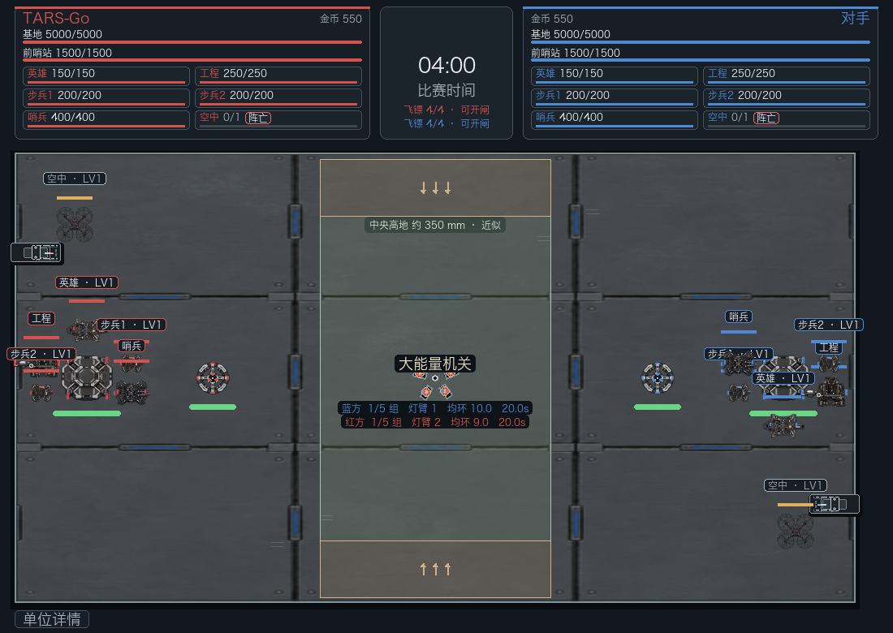
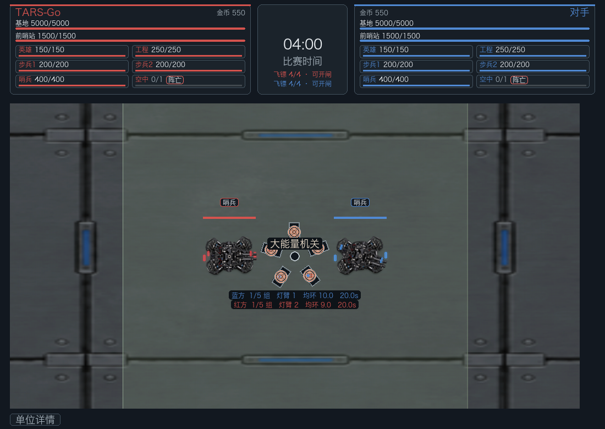

# RMUC 2026 Regional V1.4.0 Rules Lab

This document records the audited baseline implemented by RuleSet
`rmuc-2026-region-v1.4.0`. It is intentionally partial and must coexist with
future national-stage RuleSets rather than being overwritten by later manuals.

## Source identity

- Competition: RMUC
- Season: 2026
- Stage: regional
- Official version: V1.4.0
- Status in this repository: `official-partial`
- Official rule PDF: [RoboMaster 2026 Super RoboMaster Competition Rule Manual V1.4.0](https://bbs-web-static.robomaster.com/38afa6d7914345f7bb5d496692fd429b1773977681621/RoboMaster%202026%20%E6%9C%BA%E7%94%B2%E5%A4%A7%E5%B8%88%E8%B6%85%E7%BA%A7%E5%AF%B9%E6%8A%97%E8%B5%9B%E6%AF%94%E8%B5%9B%E8%A7%84%E5%88%99%E6%89%8B%E5%86%8CV1.4.0%EF%BC%8820260320%EF%BC%89.pdf)
- Primary rule baseline: V1.4.0 §2 key terms, §5.1.3 Shooting Heat,
  §5.1.1 attack damage, §5.1.4 chassis power over-limit, §5.3 Economy including Tables 5-5 through
  5-11, §5.3.3 Tech Core–Energy Unit mechanism, §5.4 Experience /
  Performance Systems including Tables 5-13 through 5-17, §5.5.1 Base and
  Outpost mechanism, §5.5.3.5 Terrain Crossing Buff Point Mechanism, §5.6.5
  Dart System, and §5.6.6 Radar special mechanism.
- V1.4.2 is used only as a cross-check where wording is unchanged; this
  RuleSet's identity remains V1.4.0.

The regional match lasts seven minutes. The formal roster contains Hero,
Engineer, Infantry ×2, Drone, Sentry, Dart System, and Radar. This Rules Lab
instantiates Hero, Engineer, Infantry ×2, Drone, Sentry, Base, and Outpost.
Dart is represented by per-team rule state and referee-style launch/hit events;
Radar remains deferred.

## Experience System

Hero, Infantry, and Drone participate in the current progression state.
Engineer and Sentry do not gain Experience. Drone uses the same official
Lv1-Lv10 Experience thresholds; its Performance changes only launcher Heat
Limit and Cooling because V1.4.0 does not define Drone HP/chassis-power fields.

Progression belongs to `RMUC2026RegionalRules`, not to the generic `Robot`
model. Each eligible robot owns private rule state equivalent to:

```text
experience: float
level: int
```

Experience uses `float` so official average allocations can be applied without
rounding them into a different total.

### Level thresholds

| Level | Experience |
| ---: | ---: |
| 1 | 0 |
| 2 | 550 |
| 3 | 1100 |
| 4 | 1650 |
| 5 | 2200 |
| 6 | 2750 |
| 7 | 3300 |
| 8 | 3850 |
| 9 | 4400 |
| 10 | 5000 |

All ten levels are stored and validated. Teams start at a Lv5 cap; D2/D3
completion can unlock Lv7 and Lv10 during the match.

### Current level cap

Both teams start with `level_cap = 5`. First completion of Tech Core
Difficulty 2 raises that team's cap to 7, and first completion of Difficulty 3
raises it to 10.

At the current cap, Experience is clamped exactly to that cap's threshold and
the robot stops gaining additional shot, damage, or kill Experience. It does
not accumulate hidden XP for a future instant upgrade. Raising the cap does not
restore previously discarded XP or auto-level any robot; only future Experience
continues progression.

### Deterministic combat Experience sources

Known-source Experience is implemented using existing match facts.

- committed Hero attack intent: +10 XP;
- committed Infantry attack intent: +1 XP;
- committed Drone attack intent: +1 XP;
- Robot actual HP damage: +4 XP per actual HP lost;
- Outpost actual HP damage: +2 XP per actual HP lost;
- Base actual HP damage: +1 XP per 2 HP, with odd actual damage rounded up;
- Robot destruction: kill Experience described below.

Sentry receives no personal Experience and Engineer has no launcher in this
slice. Team attack-damage accounting remains independent from personal
Experience.

Damage Experience always uses `event.damage`, which is the actual HP loss.
Therefore invincible Base attacks and Base hits absorbed entirely by Virtual
Shield generate no damage Experience; Defense-reduced hits award Experience
only for the post-Defense HP loss, and overkill awards Experience only for
remaining HP.

### Kill Experience

For a known eligible attacker:

```text
if victim_level >= attacker_level:
    XP = 50 × victim_level × (1 + 0.2 × (victim_level - attacker_level))
else:
    XP = 50 × victim_level
```

Hero and Infantry victims use their current progression level. Engineer and
Sentry are treated as Lv1 for this calculation. Drone is an eligible attacker
and uses its current progression level, but V1.4.0 makes ordinary attack and
collision HP damage inapplicable to Drone, so it is not a normal kill target.

Engineer and Sentry attackers do not gain Experience and their kill Experience
is not redistributed to teammates in this slice.

### Processing order

The simulator keeps the existing deterministic event order:

1. `on_attack_committed` grants shot XP when Combat commits a legal attack;
2. `ROBOT_DAMAGED` / `STRUCTURE_DAMAGED` grant actual-damage XP;
3. `ROBOT_DESTROYED` grants kill XP.

No event-system rewrite is introduced for edge cases around a single hit that
also crosses a level threshold.

Unknown-source / redistributed Experience is deferred because the current event
model intentionally does not classify projectile, penalty, or other future
damage-source taxonomies. Dart Experience is applied only by the explicit
V1.4.0 hit effects below; Dart HP loss itself does not grant Experience.

Hero deployment-mode Experience remains deferred. Large Energy Mechanism
activation distribution and Dart hit Experience are implemented through the
existing progression state. Terrain Crossing Experience is implemented
separately. Drone progression itself is shared with Hero and Infantry; Air
Support activation or Gold-Coin continuation does not independently award
Experience.

## Performance System

The full V1.4.0 Lv1-Lv10 Performance tables are stored in YAML. D2/D3 Tech Core
completion can unlock the higher levels during the match without re-entering or
duplicating Performance data.

Performance selection is read from YAML when the RuleSet is created and cannot
be changed during a match.

### Rules Lab defaults

- Hero: `long-range-priority`;
- Infantry chassis: `hp-priority`;
- Infantry launcher: `cooling-priority`.

Both Infantry robots share the same Rules Lab selection. The team configuration
schema is not expanded for per-Infantry loadouts in this round.

### Hero — close-range-priority

| Lv | HP | Power | Heat Limit | Cooling |
| ---: | ---: | ---: | ---: | ---: |
| 1 | 200 | 70 | 140 | 12 |
| 2 | 225 | 75 | 150 | 14 |
| 3 | 250 | 80 | 160 | 16 |
| 4 | 275 | 85 | 170 | 18 |
| 5 | 300 | 90 | 180 | 20 |
| 6 | 325 | 95 | 190 | 22 |
| 7 | 350 | 100 | 200 | 24 |
| 8 | 375 | 105 | 210 | 26 |
| 9 | 400 | 110 | 220 | 28 |
| 10 | 450 | 120 | 240 | 30 |

### Hero — long-range-priority

| Lv | HP | Power | Heat Limit | Cooling |
| ---: | ---: | ---: | ---: | ---: |
| 1 | 150 | 50 | 100 | 20 |
| 2 | 165 | 55 | 102 | 23 |
| 3 | 180 | 60 | 104 | 26 |
| 4 | 195 | 65 | 106 | 29 |
| 5 | 210 | 70 | 108 | 32 |
| 6 | 225 | 75 | 110 | 35 |
| 7 | 240 | 80 | 115 | 38 |
| 8 | 255 | 85 | 120 | 41 |
| 9 | 270 | 90 | 125 | 44 |
| 10 | 300 | 100 | 130 | 50 |

### Infantry chassis — power-priority

| Lv | HP | Power |
| ---: | ---: | ---: |
| 1 | 150 | 60 |
| 2 | 175 | 65 |
| 3 | 200 | 70 |
| 4 | 225 | 75 |
| 5 | 250 | 80 |
| 6 | 275 | 85 |
| 7 | 300 | 90 |
| 8 | 325 | 95 |
| 9 | 350 | 100 |
| 10 | 400 | 100 |

### Infantry chassis — hp-priority

| Lv | HP | Power |
| ---: | ---: | ---: |
| 1 | 200 | 45 |
| 2 | 225 | 50 |
| 3 | 250 | 55 |
| 4 | 275 | 60 |
| 5 | 300 | 65 |
| 6 | 325 | 70 |
| 7 | 350 | 75 |
| 8 | 375 | 80 |
| 9 | 400 | 90 |
| 10 | 400 | 100 |

### Infantry launcher — burst-priority

| Lv | Heat Limit | Cooling |
| ---: | ---: | ---: |
| 1 | 170 | 5 |
| 2 | 180 | 7 |
| 3 | 190 | 9 |
| 4 | 200 | 11 |
| 5 | 210 | 12 |
| 6 | 220 | 13 |
| 7 | 230 | 14 |
| 8 | 240 | 16 |
| 9 | 250 | 18 |
| 10 | 260 | 20 |

### Infantry launcher — cooling-priority

| Lv | Heat Limit | Cooling |
| ---: | ---: | ---: |
| 1 | 40 | 12 |
| 2 | 48 | 14 |
| 3 | 56 | 16 |
| 4 | 64 | 18 |
| 5 | 72 | 20 |
| 6 | 80 | 22 |
| 7 | 88 | 24 |
| 8 | 96 | 26 |
| 9 | 114 | 28 |
| 10 | 120 | 30 |

The Lv9 cooling-priority Heat Limit is intentionally 114, matching the V1.4.0
table.

### Effective parameters

The RuleSet derives one minimal effective Performance view for each eligible
robot:

```text
max_hp
chassis_power_limit
heat_limit
cooling_per_second
```

Hero gets all four values from its selected whole-robot profile. Infantry gets
HP/Power from its selected chassis profile and Heat/Cooling from its selected
launcher profile.

Hero/Infantry initial `RobotParameters.max_hp` now comes from the selected Lv1
Performance table; the YAML no longer duplicates those max-HP or chassis-power
values under `lab_robot_parameters`. Engineer remains fixed at 250 HP / 120 W
metadata and Sentry remains fixed to this slice's existing parameters.

All four selected Performance outputs now have gameplay consumers in the Rules
Lab. Max HP drives robot HP, Heat Limit/Cooling drive Shooting Heat, and chassis
power limit drives the synthetic chassis Buffer model described below.

### HP behavior on level-up

When an eligible living robot levels up, current HP increases only by the
increase in max HP.

Example, Hero long-range-priority:

```text
before: 100 / 150
Lv1 -> Lv2
after:  115 / 165
```

The robot does not heal to full. Current HP is capped at the new max HP. If a
dead eligible robot receives a synthetic/test level update, max HP may change
but `alive=False` and `hp=0` are preserved.

A single Experience grant may cross several thresholds; the final level and
Performance are applied directly while preserving the cumulative max-HP delta.

## Chassis Power Limit and Buffer Energy

RMUC chassis power state belongs only to `RMUC2026RegionalRules`. Generic
`Robot` does not gain Buffer, power-limit, instantaneous-power, or power-off
fields. Hero, Engineer, both Infantry robots, and Sentry all receive a private
state equivalent to:

```text
buffer_energy: float
power_off_remaining: float
blocked_this_frame: bool
```

The current effective Buffer Energy maximum is the V1.4.0 base value:

```text
Q = 60 J
```

A small `_effective_buffer_energy_max(robot_id)` helper currently returns 60
for every ground robot. Buffer Energy Buffs or terrain bonuses are not modeled
and no modifier framework is introduced.

### Power-limit source

The current effective chassis power limit `Pl` is never cached in chassis
state.

- Hero and Infantry read `_effective_performance(robot_id).chassis_power_limit`;
- Engineer reads the existing fixed 120 W Rules Lab robot metadata;
- automatic Sentry reads the existing fixed 100 W metadata.

With the current selections, Hero long-range-priority begins at 50 W and
Infantry hp-priority begins at 45 W. Level-up immediately changes future
`Pl` without changing current Buffer Energy or an active power-off timer.

### 10 Hz official settlement equation

The V1.4.0 chassis-power over-limit mechanism is represented at 10 Hz. Every
complete 0.1-second tick applies:

```text
Z = Z - (Pr - Pl) * 0.1
Z = min(Q, Z)

if Z <= 0:
    Z = 0
    if Pr > Pl and chassis was not already powered off:
        power_off = 5 s
```

Here `Z` is current Buffer Energy, `Pr` is instantaneous chassis output
power, and `Pl` is the current effective chassis power limit.

The RuleSet keeps an independent `_chassis_power_accumulator`; it is not shared
with Shooting Heat's 10 Hz accumulator. Partial ticks are retained and large
updates execute every complete tick.

### Rules Lab synthetic instantaneous power

The simulator has no motor dynamics, wheel-speed model, robot mass/acceleration
model, voltage/current telemetry, power-management module, or supercapacitor
physics. Therefore its `Pr` is explicitly a deterministic Rules Lab stress
approximation rather than measured or official physical chassis power.

The current convention is:

```text
dead robot                     -> Pr = 0
power_off_remaining > 0        -> Pr = 0
robot.path is non-empty        -> Pr = current Pl + 5 W
otherwise                      -> Pr = 0
```

Thus a pathing robot always stresses Buffer by 5 W above its current limit,
which drains exactly 5 J/s. A full 60 J Buffer therefore reaches zero after
about 12 seconds of continuous synthetic movement intent.

This model uses **path intent**, not measured displacement. A robot that is
collision-blocked but still owns a path continues to request `Pl + 5 W`.
That keeps the rule deterministic without turning the Rules Lab into a motor or
traction simulator.

### Stationary recharge and power-off interval

The same official equation naturally restores Buffer whenever `Pr < Pl`.
For example, a stationary Lv1 long-range Hero has `Pr=0`, `Pl=50`, so one
0.1-second tick changes Buffer from 30 J to 35 J, capped at Q=60 J.

During the 5-second chassis power-off interval, this Rules Lab interprets
`Pr=0` and continues the same 10 Hz Buffer equation. The Buffer therefore
recovers during power-off and never exceeds the current Q.

The audited rule specifies the five-second power-off and the Buffer equation but
does not fully spell out referee-system internal ordering during the off
interval. `power-off -> Pr=0 -> normal Buffer settlement` is therefore an
explicit Rules Lab convention, consistent with this repository's established
RMUL Rules Lab behavior.

### Movement-only power-off and conservative frames

`prepare_movement(match, dt)` runs before movement commit. If any chassis tick
in the frame triggers power-off, `blocked_this_frame` is set immediately so
the robot does not move in that frame.

Likewise, if a frame begins with any remaining power-off duration, that complete
simulation frame remains movement-blocked even when the final 0.1-second tick
reduces the timer to zero. Movement resumes on the next simulation frame.

This conservative whole-frame behavior avoids inventing sub-frame movement
integration. A 0.1-second frame that begins with 0.05 seconds of power-off does
not attempt to move for its final 0.05 seconds.

Power-off does **not** clear `robot.path`. Player and AI path planning can
continue while the chassis is off; once power returns, the latest path is used.
The robot also remains alive, collidable, targetable, damageable, and able to
fire if its existing Projectile Allowance and Shooting Heat gates permit it.
Power-off does not reset the remote-exchange disengage timer.

Tech Core, Outpost rebuild, and Sentry supply eligibility retain their existing
position/alive semantics. Being chassis-powered-off does not by itself cancel a
Tech Core attempt, stop rebuild progress for an Engineer already in the rebuild
zone, or prevent a Sentry already in its supply zone from claiming accumulated
allowance.

### Death and reset

When a ground robot is destroyed, the existing `ROBOT_DESTROYED` consumer also
resets:

```text
buffer_energy = current effective Q
power_off_remaining = 0
blocked_this_frame = false
```

Projectile Allowance is not cleared. Shooting Heat keeps its previous death
semantics: Heat becomes zero and temporary Heat lock clears, while permanent
Heat lock remains permanent for the round.

Match reset returns every ground robot to 60/60 J, clears power-off/frame block,
sets displayed synthetic power to zero, and clears the chassis 10 Hz
accumulator.

Actual motor/electrical power, voltage/current, supercapacitor behavior,
wireless charging, Buffer Energy Field Buffs, terrain Buffer bonuses, Sentry
posture/semi-automatic power profiles, penalty-induced or abnormal-offline
power-off, and chassis total-energy-limit systems remain deferred.

## Economy

RMUC team coins are private `RMUC2026RegionalRules` state. They are not stored
on generic `Match`, Team, or Robot objects, and this implementation does not
reuse RMUL's economy state.

### Initial coins and complete-form assessment ratings

The V1.4.0 baseline is 400 initial coins per team. Regional-match initial coins
are modified by the complete-form assessment ratings:

| Rating | Project document | Technical solution |
| --- | ---: | ---: |
| S | +50 | +150 |
| A | +25 | +75 |
| B | 0 | 0 |
| C | -25 | -25 |
| D | -50 | -50 |

The Rules Lab has no qualification/judging module, so it explicitly selects
`B/B` as its neutral pre-match rating. Default initial coins are therefore
400. The calculation is floored at zero even though the current official table
cannot make the 400 baseline negative.

### Official timed grants

The elapsed-time representation of V1.4.0 Table 5-5 is:

| Elapsed | Grant |
| ---: | ---: |
| 60 s | +50 |
| 120 s | +50 |
| 180 s | +50 |
| 240 s | +50 |
| 300 s | +50 |
| 360 s | +150 |

Each grant is consumed once through a monotonic grant index. A large update
crossing several grant times settles every crossed grant; for example 50 s →
190 s grants +50 at 60, 120, and 180 for +150 total.

Timed grants are independent from Tech Core periodic income and are not included
in the displayed 10-second periodic rate.

### Tech Core periodic income

Tech Core completion now consumes the existing
`periodic_gold_per_10s` reward data:

- D1 first +50/10 s; repeat +5/10 s;
- D2 first +25/10 s; repeat +10/10 s;
- D3 first +25/10 s; repeat +15/10 s;
- D4 first/only +50/10 s.

Each success adds only that completion's first/repeat amount to the team's
stored gross periodic rate. Historical completion counts are not rescanned or
reconstructed.

The official example therefore resolves exactly as:

```text
D1 first  50
D2 first +25
D3 first +25
D2 repeat +10
D1 repeat  +5
----------------
gross      115 coins / 10 s
```

D2/D3 level-cap unlock behavior remains independent and unchanged.

### D4 priority-failure penalty

A D4 attempt that became active through the cross-team priority-takeover path
and then fails still permanently locks that team out of D4. Its existing
`d4_priority_failure_gold_penalty = 25` state is now also consumed by the
income economy.

The displayed current rate is:

```text
net periodic rate = gross Tech Core rate - 25
```

The net rate may be negative. Wallet settlement is always floored at zero:

```text
coins = max(0, coins + net_tick)
```

The penalty persists until match end/reset; it is not removed after 90 seconds.
Normal D4 failures still create only the 90-second retry lockout and no gold
penalty.

### Rules Lab 10-second settlement convention

V1.4.0 publicly specifies the 10-second period and the reward/penalty amounts,
but the currently auditable public text does not specify the referee system's
settlement phase. This Rules Lab therefore chooses one deterministic convention:

**Tech Core income and the D4 penalty settle on global battle-stage 10-second
boundaries: elapsed 10, 20, 30, ... 410.**

This is a Rules Lab convention, not a claim about an undocumented referee-system
implementation detail. If later official clarification establishes a different
phase, only the tick schedule needs to change; the team economy state and reward
accumulation architecture do not.

A reward completed at elapsed 24 starts contributing at the 30-second tick. A
legal explicit completion at exactly a still-unsettled 30.0-second boundary is
applied before that 30-second settlement. Large updates settle every crossed
10-second boundary. If a priority D4 fails partway through a large update, the
penalty stores its exact activation timestamp so ticks before the failure are
not retroactively reduced.

The 420-second match-end boundary is not a periodic payout tick; the last global
periodic boundary is 410 seconds. Once `Match.finished` is true, no timed grant,
periodic Tech Core income, or penalty tick is processed.

### Spending boundary

Gold-Coin projectile exchange, remote healing, paid immediate respawn, and
Drone Air Support continuation are implemented. The economy HUD exposes each
team's current wallet and Tech Core gross/penalty/net periodic rate.

## Drone Air Support

V1.4.0 §5.6.3 and Table 5-8 define one simple support-time resource:

- each Drone starts the battle stage with 30 seconds of Air Support time;
- at elapsed 60/120/180/240/300/360 seconds it gains another 20 seconds;
- the operator may call or pause Air Support, with no separate cooldown or
  activation-count limit stated by V1.4.0;
- while Air Support is active the Drone is considered alive, and its launcher
  is unlocked only while it is not touching the helipad;
- after available support time is exhausted, continuing Air Support exchanges
  1 Gold Coin for each additional second, with no purchase-count limit;
- if neither support time nor enough team coins are available, Air Support
  cannot continue and the Drone returns to its helipad/inactive state.

The Rules Lab stores free grants and already-purchased remainder in one
`available_seconds` pool. A paid second is exchanged atomically when the active
Drone needs another second. Any sub-second remainder of that already purchased
second survives an explicit pause and can be used after resuming. The public
manual specifies the 1 coin / 1 second rate but not a sub-frame settlement
phase, so this start-of-second exchange is an explicit deterministic simulator
convention rather than an additional official rule claim.

Periodic grants are processed chronologically inside large updates. A grant at
an exact minute boundary is applied before the simulator purchases the next
paid second, preventing a frame-size-dependent extra charge.

Air Support does not modify Experience, Level, or Performance. Drone committed
shots still grant +1 shot Experience, damage/kill Experience follows the
existing known-source rules, and current Drone level continues to select the
official Heat Limit/Cooling row. Air Support itself adds no HP, chassis power,
or extra Projectile Allowance.

V1.4.0 also defines a separate Radar laser countermeasure. Only while the
opponent Drone has initiated Air Support may the opposing Radar laser mechanism
be active. The Drone carries a separate targeting progress P in [0, 100].
Continuous illumination is evaluated every 0.1 s: the nth uninterrupted
judgement adds n points. When illumination is broken, the uninterrupted
counter resets immediately and P decays at 0.5/s without going below zero.

The first/second/third lock thresholds P0 are 50/100/100. Reaching P0 resets P
and locks only the Drone launcher for 45 s; at most three locks are available
per match. The lock does not stop Air Support, movement, Experience, or
Performance, and this state is intentionally independent from Radar's
ground-only Vulnerability state.

The manual also shrinks the physical laser-detection area after successful
locks (to 3/5 and then 1/5 of the original vertical area) and disables active
lighting for the third attempt. Those physical optical/geometry details remain
deferred because the Rules Lab intentionally has no 3D laser/detector geometry;
the official 50/100/100 thresholds are modeled without inventing a substitute
spatial mechanic.

## Projectile Allowance and Gold-Coin Exchange

Projectile Allowance is RMUC RuleSet-private state. Generic `Robot` does not
gain an ammo/allowance field, and the implementation does not reuse RMUL's
projectile economy.

### Initial allowance and compatible launchers

The Rules Lab records the V1.4.0 initial values:

| Robot | Projectile | Initial allowance |
| --- | --- | ---: |
| Hero | 42 mm | 0 |
| Infantry | 17 mm | 0 |
| Sentry | 17 mm | 300 |
| Drone | 17 mm | 750 |

Drone is instantiated as an aerial unit with 750 initial 17 mm allowance and
cannot acquire additional allowance during the seven-minute battle stage.

Hero can exchange only 42 mm allowance. Infantry and Sentry can exchange only
17 mm allowance. Engineer has no launcher and no allowance state.

A committed synthetic shot consumes exactly one unit of the matching allowance.
If allowance is zero, `can_attack()` rejects the synthetic attack. There is no
overfire model in this slice.

### Team purchase limits and prices

Only allowance acquired through Gold-Coin exchange counts against the team-wide
purchase caps. Initial Sentry allowance, Sentry supply grants, and future Drone
initial allowance do not count.

| Projectile | Team purchase cap | Non-remote | Remote |
| --- | ---: | --- | --- |
| 17 mm | 1000 | 10 coins → 10 rounds | 150 coins → 100 rounds |
| 42 mm | 100 | 10 coins → 1 round | 150 coins → 10 rounds |

Both Infantry robots and Sentry share the same 17 mm purchased total. Hero uses
the team 42 mm purchased total. Transactions are atomic and never shrink a
purchase unit to fit the remaining cap.

### Non-remote exchange

`exchange_projectiles()` is the non-remote action. It requires a living
eligible robot to occupy one of its own-side Resupply, Base, or Outpost Buff
Points, sufficient team coins, and enough remaining team purchase capacity.

The current full official field is not reconstructed, so the Rules Lab provides
six 180-degree-symmetric synthetic rectangles:

- red/blue supply-buff;
- red/blue base-buff;
- red/blue outpost-buff.

For this slice `Zone.contains(robot.position)` is the complete occupancy
abstraction. The existing Base and Outpost rectangles are also reused by the
static Defense Buff consumer described below. The Resupply rectangle is also
the rule-level healing and automatic-respawn acceleration zone described below.

A successful non-remote exchange immediately deducts coins, increases the team
purchased counter, and increases the robot's allowance.

### Out-of-combat state and remote exchange

V1.4.0 defines a robot as out of combat when it is alive and for six continuous
seconds has neither fired a projectile nor suffered HP loss.

Eligible RMUC launcher robots therefore start the Rules Lab with
`disengaged_elapsed = 6`, matching the rule that robots are initially out of
combat. A committed shot or any `ROBOT_DAMAGED` event resets this private
timer. No generic `Robot.disengaged`, `last_shot_at`, or damage taxonomy is
introduced.

`remote_exchange_projectiles()` checks the out-of-combat condition once when
the purchase command is accepted. It does not require occupancy of an exchange
zone. The full remote cost and team purchase capacity are consumed immediately,
but the allowance itself is delivered after six seconds.

Each accepted remote purchase creates one private pending delivery containing
an amount and absolute `effective_at` time. Multiple deliveries may coexist.

The currently audited rule text states that a successful remote exchange becomes
effective after six seconds and does not state a cancellation condition if the
robot subsequently fires, takes damage, or is defeated during that delay.
Accordingly, the Rules Lab keeps an accepted delivery and does not refund it.
A later official clarification can change this without altering the purchase
state architecture.

### Discrete delivery timing

Match combat is intentionally not refactored into sub-frame simulation.

If a long `Match.update(dt)` crosses a pending delivery's six-second deadline,
the delivery is settled at the end of that frame. Combat earlier in the same
frame does not retroactively gain the allowance; the newly delivered allowance
can be used starting with the next combat frame.

A delivery whose deadline is at or beyond the 420-second match-end boundary is
not applied after the match has ended.

## Robot Lifecycle and Resupply

RMUC lifecycle state remains private to `RMUC2026RegionalRules`; generic
`Robot` does not gain respawn, Weakened, Invincibility, healing-rounding, or
out-of-combat fields. The same private lifecycle state now owns the six-second
out-of-combat timer for every ground robot, including Engineer. Projectile
Allowance keeps only projectile-specific state.

### Resupply healing

A living ground robot inside its own Resupply Buff Point recovers:

```text
10% * current max HP / second
```

After elapsed 240 seconds, the rate becomes 25% max HP/s for the portion of
time in which that robot is also out of combat. Firing or suffering HP loss
resets the six-second out-of-combat timer. Large simulation frames split the
healing integral at both the 240-second boundary and the six-second
out-of-combat boundary rather than applying the later rate retroactively to the
whole frame.

Healing uses official half-up integer settlement. To keep arbitrary simulation
frame sizes deterministic, the Rules Lab carries only the signed rounding
residual between consecutive eligible frames and applies the delta of cumulative
half-up settlement. Thus an exact 52.5 HP entitlement settles as 53 HP without
turning ten 0.1-second frames into a different result from one 1-second frame.
Healing never exceeds current max HP. It is an HP increase inside the RuleSet
and does not create a second HP-loss path; `Match.apply_damage()` remains the
only HP-loss entry point.

### Remote healing

V1.4.0 §5.2.1 permits only Hero, Infantry, and Sentry to exchange Gold Coins
for remote healing, and only while that robot is out of combat. Engineer is not
listed. The exchange is a delayed one-shot heal rather than a healing rate:
six seconds after confirmation, the living robot gains 60% of its **current**
max HP, capped at current max HP.

Table 5-8 prices each exchange as:

```text
50 + ROUNDUP((elapsed_match_seconds / 60) * 20)
```

Gold Coins are reserved immediately when the request is accepted. If the robot
dies during the six-second pending window, the delivery is cancelled and those
coins are explicitly not refunded. Re-entering combat after confirmation does
not cancel the pending heal; V1.4.0 states out-of-combat as the confirmation
condition and names death as the pending-window cancellation condition.

The 60% heal is settled once at delivery time using current max HP. The general
V1.4.0 HP-settlement rule rounds to the nearest integer, so the Rules Lab uses
the existing half-up convention for this one-shot result. It does **not** reuse
Resupply's cross-frame `healing_rounding_residual`, because remote healing is
not a continuous rate. Large simulation frames that cross the six-second
deadline settle the heal once at that frame's rule-update boundary.

V1.4.0 sets the exchange limit to "unlimited", so a robot may make another
exchange after a previous delivery completes. The manual does not explicitly
say whether multiple six-second remote-healing transactions may be pending for
one robot at the same time. The current Rules Lab therefore uses the minimal
deterministic convention of at most one pending remote heal per robot; a repeat
request during that pending window fails atomically without charging coins.
This concurrency restriction remains an explicit audit gap rather than an
official claim.

The manual also does not say that current HP must be below max HP before an
exchange is accepted. The Rules Lab therefore does not invent that precondition:
a full-HP eligible robot may buy the exchange, and the eventual one-shot heal is
simply capped at max HP.

Weakened is not named as a remote-healing exclusion. The Rules Lab therefore
applies only the explicit conditions—eligible robot type, living state, and
out-of-combat state—and permits a Weakened Hero/Infantry/Sentry to confirm
remote healing once its out-of-combat timer reaches six seconds. This is kept as
an audit edge because V1.4.0 does not discuss Weakened and remote healing
together.

Local Resupply healing and delayed remote healing remain independent positive HP
sources. In a frame where both settle, the continuous Resupply entitlement is
settled first and the one-shot remote heal is then added, with both capped by
current max HP. Since both only increase HP and use the same max-HP cap, no
additional stacking multiplier is introduced.

Death clears the pending remote-healing deadline without refund. Automatic or
paid immediate respawn does not restore that cancelled request. Match reset
recreates lifecycle and wallet state, clearing any pending remote heal.

The single-pass Rules Lab consumes death events before delayed healing delivery.
Therefore, if a discrete frame contains both a destruction event and a remote
healing deadline, death cancellation wins for that frame. V1.4.0 does not spell
out this exact same-frame simulator boundary.

### Automatic respawn progress

When a robot is defeated, the required progress is frozen from the defeat time:

```text
required =
  round_half_up(
    10
    + elapsed_at_death / 10
    + 20 * cumulative_immediate_respawn_count
  )
```

The current slice initializes the immediate-respawn count to zero and preserves
it as lifecycle state for the later paid-immediate-respawn action.

A newly defeated robot starts accumulating on the next simulation frame.
Normal progress is 1/s. Progress is 4/s while the defeated robot's stored field
position is inside its own Resupply Buff Point, or while its own Base HP is
strictly below 2000. The requirement is not recomputed if those conditions
change later.

When progress reaches the frozen requirement, the robot revives at its stored
position with:

- 10% of current max HP, settled half-up with a minimum of 1 HP;
- existing Level and Experience preserved;
- existing Projectile Allowance preserved;
- 30 seconds of Invincibility;
- Weakened state.

The V1.4.0 rounding audit is closed by two independent clauses in the same
manual. In §2, the note under initial HP states that the referee system rounds
when settling HP and keeps an integer result. In §5.2.2, completion of the
automatic respawn bar restores HP to 10% of max HP. Because automatic respawn is
therefore a referee-system HP settlement, the one-shot result uses the same
half-up convention; it does not reuse Resupply's cross-frame rounding residual.
For example, 250 max HP revives at 25 HP and 165 max HP revives at 17 HP.

The existing death consumer still resets Heat Q1 and temporary Heat lock,
chassis Buffer/power-off state, Terrain state, and active occupancy. Permanent
Heat lock remains preserved across defeat and automatic respawn.

### Paid immediate respawn

V1.4.0 §5.2.2 states that a defeated robot may exchange Gold Coins for an
immediate respawn while its normal respawn bar is in progress. The robot keeps
its pre-defeat Level and Experience and immediately returns with:

- 100% of current max HP;
- 3 seconds of Invincibility;
- launcher immediately unlocked, therefore no Weakened state;
- chassis power limit multiplied by 2, capped at 200 W, for 4 seconds.

The current Rules Lab implements this for every instantiated ground robot that
has the RMUC lifecycle state: Hero, Engineer, Infantry, and Sentry. Drone does
not participate because V1.4.0 marks its healing/respawn mechanism as not
applicable; its alive state is controlled by Air Support instead.

The Table 5-8 immediate-respawn price is settled at request time as:

```text
ceil(elapsed_match_seconds / 60) * 80
+ current_robot_level * 20
```

The cumulative number of previous immediate-respawn exchanges does not enter
this price formula. A successful exchange increments
`immediate_respawn_count`; that updated count is then used only by the next
automatic-respawn requirement, which remains:

```text
round_half_up(
    10
    + elapsed_at_next_death / 10
    + 20 * cumulative_immediate_respawn_count
)
```

A purchase is accepted only after the defeat event has registered and the
normal respawn bar exists. The Rules Lab treats one accepted request as an
atomic transaction: sufficient Gold Coins are checked first, then the wallet is
debited exactly once and the same call settles the respawn. Insufficient funds,
a living robot, a death that has not yet entered the respawn-bar state, or a
repeat request after successful revival all return without changing wallet or
lifecycle state.

Immediate and automatic respawn share one private `_settle_respawn(...)`
helper for HP restoration, clearing the current respawn bar/progress, path
clearing, Invincibility/Weakened settlement, out-of-combat reset, and healing
rounding state. The immediate path uses an HP fraction of 1.0, so current max HP
is restored exactly; there is no fractional HP rounding edge for the 100%
settlement. The automatic path continues to use the audited 10% half-up
settlement.

The immediate 4-second chassis-power modifier is stored as one private lifecycle
timer. `_effective_chassis_power_limit()` applies
`min(200 W, base_limit * 2)` while that timer is positive. A later death clears
the timer, and match reset recreates all lifecycle state with zero immediate
respawns and no active boost.

Two V1.4.0 text boundaries remain explicit rather than being promoted to
official facts. First, Table 5-8 prices immediate respawn using "robot level",
while §5.4.1 excludes Engineer and Sentry from the Experience System; the manual
only explicitly treats Engineer/Sentry as level 1 inside the robot-destruction
Experience calculation. This Rules Lab therefore uses its existing non-
progression level convention of 1 for Engineer/Sentry pricing and records that
specific cross-section interpretation as a gap. Second, §5.6.4 distinguishes a
Sentry autonomous action from gimbal-operator intervention: operator actions
cost an additional 50 Gold Coins for automatic Sentry, while semi-automatic
Sentry operator actions do not. The current Rules Lab has no action-origin or
semi-automatic-Sentry control model, so `purchase_immediate_respawn()` models
the ordinary/autonomous Table 5-8 transaction only; the operator-intervention
surcharge path remains deferred.

### Weakened and post-respawn Invincibility

A Weakened robot cannot fire, occupy modeled Buff Points, or contribute to
Outpost rebuild progress. This includes Central/Base/Trapezoid/Outpost Defense
occupancy, own/enemy Fortress occupancy, Terrain Crossing acquisition, and
Assembly-zone Tech Core operation. D1-D3 and D4 start/confirmation are rejected
while Weakened, and an already-active assembly treats Weakened time as continuous
absence from the Assembly point. Local projectile exchange is likewise
unavailable while Weakened because it requires legal Buff Point occupancy.

Detecting an occupiable own Base or Resupply Buff Point, or an Outpost Buff
Point currently legal for that robot, clears Weakened. If automatic respawn
finishes while the stored robot position is already inside one of those release
points, detection is settled in that same lifecycle update rather than being
delayed to the next frame. The automatic-respawn Invincibility is then shortened
to the official minimum of 10 total seconds since respawn: if fewer than
10 seconds have elapsed, only the remaining portion of those 10 seconds is kept;
after 10 seconds it ends immediately. Without such a release, the original
30-second Invincibility continues to count down while Weakened remains.

Robot Invincibility is enforced in the existing thin
`can_receive_damage()` gate. `resolve_damage()` remains limited to
Defense/Vulnerability/Virtual-Shield resolution.

### Engineer Assembly / Resupply field Invincibility

V1.4.0 §5.5.3 applies the common Buff Point Occupy rule to both points:
Occupy expiration has a two-second delay, while robot destruction makes the
Buff expire immediately. A Weakened robot cannot occupy any Buff Point, so a
Weakened Engineer receives neither field Invincibility source and consumes no
Assembly Invincibility budget.

The Assembly Buff Point may be occupied only by its own Engineer. While legally
Occupying it, the Engineer is Invincible for a cumulative maximum of 180
seconds. Leaving and later re-entering does not reset the consumed time. The
Rules Lab therefore stores only one round-private cumulative value per Engineer:

```text
assembly_invincibility_elapsed
```

The cumulative value advances only while Assembly Occupy is still effective,
including the official two-second Occupy-release window after physically
leaving. Death ends the active Buff immediately and pauses the cumulative value.
V1.4.0 does not separately state that death resets the already-consumed
180-second budget; the Rules Lab therefore does not invent such a reset and
preserves consumed time through death / automatic respawn. This specific
death-versus-budget-reset detail remains an explicit audit edge pending further
official clarification. Match reset starts a new round at zero. At 180 seconds
the Assembly source is exhausted for the rest of that round.

The own Resupply Buff Point is independently occupiable by all living ground
robots, but only the Engineer gains the field Invincibility effect there.
V1.4.0 specifies no cumulative duration cap and no out-of-combat prerequisite
for this Invincibility. It is separate from Resupply healing: healing keeps its
own rate/out-of-combat rules, while Engineer field Invincibility follows legal
Buff Point Occupy and the common two-second Occupy-release rule.

Automatic-respawn Invincibility, Assembly Invincibility, and Resupply
Invincibility remain independent sources. They are not added or merged into one
timer: any active source makes the Engineer unable to receive HP loss. Expiring
or exhausting one source does not modify the others.

The current Match loop has one discrete combat pass per update. Field Occupy
and the Assembly cumulative budget are settled in `prepare_combat()` before
that pass, matching the existing static Field Buff timing. If a large frame
crosses the 180-second Assembly boundary, only the remaining cumulative budget
is consumed and the value is capped at 180 seconds, but that frame's single
combat pass observes the post-settlement exhausted state. Likewise, if a
two-second Occupy-release window expires partway through a large frame, the
combat pass observes the expired state. No sub-frame combat simulation is
introduced.

These are rule-level synthetic Buff Point / RFID abstractions only; physical
Assembly geometry and referee hardware detection are not reconstructed.

Paid immediate respawn and remote healing are now implemented as the
lifecycle/economy transactions described above.

### Sentry Resupply-Zone allowance

Beginning after the match starts, every 60 seconds before match end, each team
accrues a 100-round Sentry supply opportunity at elapsed:

```text
60, 120, 180, 240, 300, 360
```

If the Sentry is not occupying its own modeled supply-buff zone, the
unclaimed amount remains in `pending_sentry_supply` and accumulates. When the
living Sentry later occupies that zone, it receives the entire pending amount
at once and the pending value returns to zero.

Thus the official accumulation example is preserved: a Sentry that has never
claimed supply allowance before elapsed 390 has 600 rounds pending and receives
all 600 on first occupation.

Sentry supply allowance costs no coins and does not consume the 17 mm team
purchase cap. If the Sentry remains in the supply zone, each newly accrued
minute grant is claimed during that update.

### Experience interaction and physical projectile foundation

`on_attack_committed()` remains the one-per-shot referee transaction. A legal
launch consumes one projectile allowance, adds the existing 10 Heat (17 mm) or
100 Heat (42 mm), and grants the existing shot Experience. The projectile then
travels independently; a launch is not damage, and a miss consumes the same
allowance and Heat as any other actual shot.

The V1.4.0 manual specifies projectile diameters of 16.8 mm (17 mm launcher) and
42.5 mm (42 mm launcher), muzzle-velocity ceilings of 25 m/s for 17 mm and
12 m/s for a normal-mode Hero 42 mm launcher, and 16.5 m/s for the qualifying
Hero Deployment Mode. It also gives effective armor-contact normal-speed
thresholds of greater than 12 m/s for 17 mm and greater than 10 m/s for 42 mm.
Rules Lab does not model Deployment Mode, drag, speed loss, elevation, or
ballistic drop. It uses those normal-mode ceilings as nominal planar speeds and
labels its firing cadence as a simulator approximation: 0.05 s (17 mm) and
0.50 s (42 mm). The simulator uses existing `attack_range` as its approximate
maximum flight distance; the manual does not define an in-simulator range or
universal firing cadence.

Each simulation projectile stores its shooter, team, caliber, damage, radius,
position, velocity, traveled distance, and remaining range. The desktop's
60 Hz fixed-step loop advances them using continuous swept collision. Robots
use the existing shared collision radius; structures and obstacles use the
already-loaded field footprints. The earliest physical contact removes the
projectile. Enemy robot/structure contact enters the normal `Match.apply_damage`
pipeline; invincibility, buffs, damage resolution, and HP accounting remain in
the RuleSet. Friendly robots and structures block shots without friendly-fire
damage. A physically hit but invincible robot still consumes the projectile
and produces zero damage. Cosmetic projectile snapshots and impact particles
read the simulation contacts but never decide collision or damage.

The hit-normal calculation uses the existing simplified collision shapes as an
armor-face proxy. That is a simulator approximation: the Rules Lab does not
model separate armor-module dimensions/orientations, per-module damage tables,
velocity decay, or the official 42 mm shielding window. Those deferred details
do not alter the current ammo, Heat, damage, buff, or invincibility pipeline.

### Predictive aim and chassis spin

Projectile aim uses the target's current position and velocity measured from
its last completed simulation-tick movement. A constant-velocity intercept is
solved separately using the launcher's configured projectile speed. If no
positive intercept time fits inside the modeled projectile range, aim falls
back to the target's current position. The predictor never reads the target's
path or future movement commands. Projectiles leave along the simulation
turret's current world heading, so turret slew and prediction can produce real
misses. Chassis heading and turret world heading are separate state; the
turret tracks the aim point while an eligible chassis spins.

V1.4.0 does not specify robot chassis-spin speed or robot turret slew rate. The
Rules Lab therefore labels its 3.0 rad/s chassis spin and 12.0 rad/s turret
turn rate as simulator approximations in YAML. The ordinary spin policy is a
deterministic visual/control behavior for Hero, Infantry, and Sentry while a
valid target is in range; spin direction is repeatable per robot. It does not
change movement, collision geometry, AI utility, or referee rules. The manual's
0.8π rad/s value is for Outpost armor rotation and is not applied to robots.

## Shooting Heat gameplay

RMUC Shooting Heat is private RuleSet state and reuses the existing
`RuleSetDisplayState.robot_shooting_heat` view. Generic `Robot` does not gain
Heat, Heat Limit, Cooling, or lock fields, and RMUL retains its independent Heat
implementation.

For each instantiated launcher robot the private state is equivalent to:

```text
heat: float
temporarily_locked: bool
permanently_locked: bool
```

Engineer has no launcher and therefore no Heat state. Drone has the same
RuleSet-private Heat state and uses its official level-dependent Heat Limit and
Cooling table while Air Support is active.

### Q0, Q1, and Q2

The V1.4.0 notation is:

```text
Q0 = current effective Barrel Heat Limit
Q1 = current Barrel Heat
```

Each committed 17 mm projectile adds 10 Heat and each committed 42 mm projectile
adds 100 Heat, independent of muzzle velocity.

The permanent threshold is derived dynamically from the current Q0:

```text
17 mm: Q2 = Q0 + 100
42 mm: Q2 = Q0 + 200
```

Q2 is never cached in the Heat state.

The V1.4.0 prose and its same-page flowchart disagree at the exact permanent
boundary: the prose states `Q1 > Q2`, while the audited flowchart uses
`Q1 >= Q2`. This Rules Lab deliberately follows the flowchart boundary and
the repository's existing RMUL convention:

```text
Q1 >= Q2 -> permanently locked
Q0 < Q1 < Q2 -> temporarily locked
Q1 <= Q0 -> no newly-triggered lock
```

This ambiguity is recorded explicitly rather than hidden behind an implementation
choice.

### Temporary and permanent locks

A temporary Heat lock persists even after cooling brings Q1 back below Q0. It
clears only when cooling clamps Q1 to exactly zero.

A permanent Heat lock never clears during the current round. Cooling to zero,
robot destruction, or a later level-up does not clear it. Only match reset does.

The official temporary-overheat behavior also affects the Operator FPV video
link. This desktop Rules Lab does not model the official FPV operating
interface, so only the launcher lock is implemented; blackout/overlay behavior
is deferred.

### 10 Hz cooling

Cooling is processed by `prepare_combat(match, dt)`, before the frame can
commit new attacks. The RuleSet keeps a fractional accumulator and executes
every complete 0.1-second tick:

```text
heat -= cooling_per_second / 10
heat = max(0, heat)
```

This preserves partial ticks and large-dt behavior. For example, Hero
long-range Lv1 has Cooling 20/s, so Heat 100 with `dt=0.35` processes three
ticks to Heat 94 and leaves 0.05 s in the accumulator.

Because cooling runs before a shot is committed, a shot in that tick is not
retroactively cooled.

### Dynamic Hero and Infantry parameters

Heat Limit and Cooling are not duplicated under `shooting_heat`.

Hero and Infantry read their current values directly from
`_effective_performance(robot_id)`. Therefore Experience level changes
immediately change future Q0 and Cooling without synchronizing another state
copy. Existing Heat Q1 and any already-triggered temporary/permanent lock are
unchanged by the level-up.

With the current Rules Lab selections:

- Hero long-range-priority Lv1: Q0 100, Cooling 20/s;
- Hero long-range-priority Lv5: Q0 108, Cooling 32/s;
- Hero long-range-priority Lv10: Q0 130, Cooling 50/s;
- Infantry cooling-priority Lv1: Q0 40, Cooling 12/s;
- Infantry cooling-priority Lv5: Q0 72, Cooling 20/s;
- Infantry cooling-priority Lv10: Q0 120, Cooling 30/s.

### Automatic Sentry

The current Sentry profile remains the full-automatic Sentry already represented
by 400 HP / 100 W. Its fixed Heat parameters are:

```text
Q0 = 260
Cooling = 30/s
Projectile = 17 mm
Q2 = 360
```

Semi-automatic Sentry and posture-dependent cooling/power modifiers are not part
of this slice.

### Committed-shot transaction ordering

`on_attack_committed()` remains the only legal synthetic shot commit path. One
commit executes in this explicit order:

```text
1. consume one Projectile Allowance
2. reset/mark out-of-combat activity
3. snapshot current effective Heat parameters
4. add per-shot Heat
5. evaluate temporary/permanent Heat lock
6. grant Hero/Infantry shot Experience
```

The shot is not pre-rejected merely because the next Heat increment will exceed
Q0. The projectile is first committed, then Heat and lock consequences are
applied.

V1.4.0 does not specify the internal ordering for the rare case where one
projectile's shot Experience simultaneously causes a level-up. The Rules Lab
therefore evaluates that projectile against the **pre-shot** effective Q0/Q2,
then grants shot Experience. A resulting new level affects subsequent shots and
cooling.

A projectile that causes a temporary or permanent lock still consumes its
allowance and still grants the normal shot Experience.

### Death, reset, and deferred modifiers

On `ROBOT_DESTROYED`, Q1 is set to zero and the temporary lock is cleared.
Permanent lock is deliberately preserved, so an automatically respawned RMUC
robot still has a locked launcher for the rest of that round.

Match reset returns all shooter Heat states to zero/unlocked and resets the
10 Hz accumulator.

Dynamic base Cooling is implemented. Energy Mechanism multipliers, Fortress
cooling bonuses, Sentry posture modifiers, other Field Buff cooling effects,
muzzle-velocity penalties/locks, allowance overfire, and 42 mm shielding remain
deferred. No generic Modifier Stack is introduced.

## Energy Unit and Tech Core D1-D4

The V1.4.0 Tech Core / Energy Unit mechanism remains RMUC RuleSet state rather
than a Robot, Structure, DamageableTarget, or physics entity.

### Energy Unit resource-credit abstraction

The previous boolean carrying flag is replaced by:

```text
energy_unit_credits: int  # 0..2 in this Rules Lab
```

This is a **rules-level resource-credit abstraction**. It does not claim that an
Engineer can physically carry two Energy Units simultaneously, and it does not
model grasp geometry, item inventory, physical stock, or world-positioned
Energy Units.

Each successful Rules Lab resource-zone pickup adds one credit up to two.
D1-D3 reserve/consume one credit when an attempt starts. D4 reserves/consumes
two credits when requested. A D1-D3 attempt started with two credits therefore
leaves one unreserved credit available instead of clearing all prepared
resources.

The resource zones remain synthetic renewable rule sources; official stock,
respawn, physical placement, and depletion semantics are not reproduced.

### Difficulty availability

| Difficulty | Available after | Prerequisite | Repeat |
| ---: | ---: | --- | --- |
| 1 | 0 s | none | allowed |
| 2 | 60 s | D1 completed at least once | allowed |
| 3 | 120 s | D2 completed at least once | allowed |
| 4 | 180 s | D3 completed at least once | **only once on success** |

Time availability never bypasses the prerequisite chain.

D1-D3 continue to use the explicit Rules Lab whole-attempt confirmation. Their
mechanical insertion / translation / rotation process is not simulated.

### Difficulty 4 global coordinator

D4 is the first RMUC rule slice in this simulator where one team's action can
change the other team's running rule state. It therefore adds one thin
RuleSet-private global coordinator. No TechCoreManager, shared-resource engine,
or Tech Core entity is introduced.

At most one D4 request can be pending or active globally. When D4 is active,
both Core slots are treated as occupied, so neither side may start D1-D3 or
another D4 until D4 succeeds or fails.

The two logical Core slots are named:

- `own`: the requester's own Tech Core;
- `opponent`: the opposing Tech Core temporarily participating in the D4
  procedure.

These names are rule slots only; no Core pose or movement geometry is modeled.

### D4 activation and 45-second window

A normal D4 request requires:

- match time at least 180 seconds;
- D3 completed at least once;
- D4 not previously completed;
- no permanent D4 lockout;
- any prior normal retry lockout expired;
- living Engineer inside its own assembly zone;
- two Energy Unit credits;
- no own D1-D3 attempt;
- no active/pending D4 conflict.

If the opponent has no D1-D3 attempt, D4 becomes ACTIVE immediately and the
45-second total window starts immediately.

If the opponent is currently attempting D1-D3, the requester instead enters a
full 15-second **priority buffer**. The opponent's existing attempt may continue
and can succeed, fail by leaving the zone, or fail by Engineer death. The buffer
does not end early even if that attempt finishes before 15 seconds. At the end
of the full buffer, any still-active opponent D1-D3 attempt is cleared and the
requester's D4 becomes ACTIVE. Only then does the 45-second D4 timer start.

Core movement, obstruction, overload sensing, and the official blocked-Core
auto-award path are not simulated.

### D4 six-step mechanical-success abstraction

D4 models Steps 1 through 6 as explicit player/test confirmations:

```text
confirm_d4_step(match, engineer, core_slot, step)
```

A confirmation means the corresponding real mechanical step has been completed.
It is not an automatic-success simulation.

Steps must be completed strictly in order. For each step, both Core slots must
complete the current step before the state machine advances. The same Core slot
cannot confirm the same step twice.

Step 1 and Step 4 have no per-pair synchronization deadline. They remain subject
only to the overall 45-second D4 window.

For Steps 2, 3, 5, and 6, after the first Core completes the step, the second
Core must complete the same step within **5 seconds**, inclusive of the exact
5.0-second boundary. Exceeding that window fails D4. When both Core slots
complete Step 6 within all timing constraints, D4 succeeds immediately; no
extra final confirmation is required.

This V1.4.0 dual-Core step synchronization differs from the older V1.0/V1.2
wording that used a three-second second-unit concept. The Rules Lab follows the
V1.4.0 Step 2/3/5/6 five-second pairing rule.

A legal final Step 6 confirmation at exactly the 45.0-second total deadline is
accepted. A later update that crosses beyond the deadline fails the attempt.
The implementation also preserves deadline crossing times across large `dt`
updates rather than starting lockouts from the end of a long frame.

### D4 failures and lockouts

All active D4 failure paths use the same cleanup path:

- total window exceeded;
- paired-step five-second window exceeded;
- active Engineer destroyed;
- Engineer continuously outside the assembly zone for 15 seconds.

Reserved D4 Energy Unit credits remain consumed/cleared.

For a normal D4 attempt, failure sets a 90-second absolute retry lockout. After
that time expires, D4 may be requested again if every other eligibility
condition is still satisfied and D4 has never succeeded.

If D4 became ACTIVE through the cross-team 15-second priority takeover path,
failure instead permanently locks that team out of D4 for the rest of the match
and records:

```text
periodic_gold_penalty_per_10s = 25
```

This penalty is consumed by the income-side economy on subsequent global
10-second settlement boundaries. It does not create a separate penalty engine,
and no spending-side economy is implemented.

### D3/D4 Defense and D4 Base reward

Tech Core first-completion reward metadata is now consumed directly by the
RMUC RuleSet without introducing a generic Buff or Modifier engine.

First D3 completion gives the team a 25% Defense value. Repeating D3 does not
stack another 25%. First D4 completion upgrades the same team value to 50%;
the two rewards use `max(current, reward)`, so D4 produces 50%, not 75%.

The Defense applies to all currently instantiated ground robots plus Outpost and
Base:

```text
Hero / Engineer / Infantry / Sentry / Outpost / Base
```

Drone is instantiated, but this Tech Core Defense consumer remains limited to
the modeled ground robots and Structures; no synthetic Drone Tech Core Defense
state is created.

Only known enemy-team attack damage is modified. The current direct-damage
pipeline uses explicit half-up integer settlement rather than Python's bankers
rounding:

```text
effective = floor(original * (1 - defense) + 0.5)
```

Examples:

```text
200 @ 25% -> 150
200 @ 50% -> 100
20  @ 25% -> 15
```

The Defense state belongs to the team, so robot destruction does not remove it.
Match reset clears it.

D4 completion count remains the sole one-time success truth. On its first and
only success, D4 now consumes all currently modeled reward metadata:

- Defense becomes 50%;
- Base receives +2000 current-HP reward with overflow converted to Virtual
  Shield;
- periodic income gains +50 Gold Coins per 10 seconds.

Base `max_hp` remains 5000. The +2000 reward is settled as:

```text
missing_hp = max_hp - current_hp
hp_gain = min(2000, missing_hp)
shield_gain = 2000 - hp_gain

current_hp += hp_gain
virtual_shield += shield_gain
```

Thus a full-health Base becomes 5000 HP + 2000 Shield, a 4500 HP Base becomes
5000 + 1500 Shield, a 3000 HP Base becomes 5000 + 0 Shield, and a 1000 HP Base
becomes 3000 + 0 Shield.

Virtual Shield is private RMUC team/Base state; generic `Structure` does not
gain a shield field.

### Small Energy Mechanism rule-level Buffs

V1.4.0 §5.5.2 gives each side one Small Energy Mechanism activation opportunity
at match time 0 s and another at 90 s; unused opportunities accumulate. The
Small phase ends at 180 s. An Infantry operator using the referee-system player
endpoint or a Sentry using the referee serial interface can start the
activation. The mechanism must be successfully activated within 20 seconds or
it returns to its inactive state.

The Rules Lab consumes the already-confirmed activation result through:

```text
activate_small_energy_mechanism_buff(match, initiator, activation_started_at)
```

The result boundary verifies that the initiator belongs to this match and is an
Infantry or Sentry, the start time falls in the Small phase, the result arrives
strictly within 20 seconds and before the 180-second phase transition, and an
unused activation opportunity exists at the supplied start time. Successful
start times are retained per team for duplicate rejection and reset with the
match. Rotating hardware, projectile hit recognition, and an incomplete
activation attempt are outside this confirmed-result API. The manual does not
say whether an opportunity is returned after an incomplete 20-second attempt;
that failure/refund path remains deferred rather than inferred here.

One confirmed activation adds a **25% Defense candidate** to every robot on the
activating team, its Base, and its Outpost for **45 seconds**. It adds no fixed
Experience award. Instead, while this window is active, any Experience awarded
to a Hero, Infantry, or Drone adds an equal extra amount, capped at **1200 total
extra Experience for that team in this activation window**. The bonus is applied
inside the existing `_grant_experience()` path, so the regular progression cap,
level changes, Drone Heat/Cooling Performance, and HUD progression display keep
their current behavior. Engineer and Sentry do not receive the Experience
bonus.

Small and Large Energy Mechanism windows use one shared timed effect list but
remain independent activations. If their Defense windows overlap, the existing
same-class max rule selects the stronger Defense candidate; the Small effect
does not add Attack or Shooting-Heat Cooling. Small Energy does not modify Drone
Air Support time, Radar Anti-Drone state, current Heat, or projectile allowance.
The team timer continues through robot death and applies to a robot that returns
while the window is active, matching the Rules Lab's existing team-window
convention; the manual does not spell out that transition separately.

### Large Energy Mechanism rule-level Buffs

V1.4.0 §5.5.2 defines a successful Large Energy Mechanism activation as the
mechanism reaching its **activated** state after all five activation groups have
been completed. During the physical activation procedure two armor modules are
lit at a time; one successful hit advances the current group and the optional
second hit can increase the total number of activated arms. A successful result
therefore reports 5 through 10 activated arms. The physical 20-second activation
window, rotating mechanism, random lit-module selection, hit timing, and ring
recognition now feed this result consumer through the P5 Rules Lab interaction.

The physical state machine uses the three cumulative opportunities at 180,
255, and 330 seconds. Infantry or Sentry can issue the activation command.
Each attempt has one 20-second total window. Five groups are completed by
hitting the first currently lit module in each pair within 2.5 seconds. The
other lit module may be hit during the following second to add another scored
lamp; omitting that optional hit advances to the next random pair without
failing the attempt. A missed 2.5-second first hit or a hit on an unlit module
clears the current five-group sequence and leaves the original 20-second
window running. The last optional second is allowed to settle the lamp count
before applying the result. The attempt then calls
`activate_large_energy_mechanism_buff()` once with the mean ring score and 5–10
scored lamps; no HUD or timer fabricates a successful result.

V1.4.0 specifies a fixed inactive speed of π/3 rad/s and, while activating,
`spd = a·sin(ω·t)+b`, where `a` is 0.780–1.045, `ω` is 1.884–2.000, and
`b=2.090−a`. The local time and parameters reset at each opportunity's
activatable timestamp. Figure 5-17 defines the Ø300 mm detection circle, ten
15 mm radial scoring bands, and 1 mm radial detection precision. The rotor uses
that same panel pose for collision and rendering. Field center, arm reach and
width, panel height/facing, and detailed support silhouette are not dimensioned
for this 2D model and remain Rules Lab approximations. At exact ring boundaries
the lower-value outer ring is selected deterministically.

The spectator AI has a near-field command-and-fire path for Infantry and Sentry,
but the unassisted standard 420-second, fixed-60-Hz match currently records no
large-mechanism commands, target shots, contacts, or activations for either
team. AI use is therefore partial. A full-field approach and successful
five-group activation are not claimed.

P5 screenshots from the actual Pygame frame renderer:





This Sprint exposes one narrow result boundary:

```text
activate_large_energy_mechanism_buff(
    team_id,
    average_ring_score,
    lit_arm_count,
)
```

The live match calls this consumer only after the physical state machine
confirms five successful groups. Invalid `average_ring_score` or
`lit_arm_count` values create no Buff state.

Table 5-18 maps average ring score to the three Buff classes:

| Average ring score | Attack | Defense | Shooting-Heat Cooling |
| --- | ---: | ---: | ---: |
| [1, 3] | 150% | 25% | none |
| (3, 7] | 150% | 25% | ×2 |
| (7, 8] | 200% | 25% | ×2 |
| (8, 9] | 200% | 25% | ×3 |
| (9, 10] | 300% | 50% | ×5 |

Table 5-19 maps the number of activated arms to one shared Buff duration:

| Activated arms | Duration |
| ---: | ---: |
| 5 | 30 s |
| 6 | 35 s |
| 7 | 40 s |
| 8 | 45 s |
| 9 | 50 s |
| 10 | 60 s |

While that window remains active, V1.4.0 says all living robots on that team
receive the Attack, Defense, and Cooling effects, while the team's Base and
Outpost receive the same Defense Buff. In the current ground-only Rules Lab,
Hero, Engineer, both Infantry, and Sentry therefore observe the team Defense
window. Hero/Infantry/Sentry can consume the Cooling multiplier through their
existing Shooting Heat state; Engineer has no launcher/Heat consumer but is not
excluded from the team Buff itself.

The Energy Mechanism remains in its activated state until the Buff duration
ends. A second activation result for the same team is therefore rejected while
the current Large Energy Mechanism window is still active. After expiry, a new
officially resolved activation result may start a fresh window. Red and blue
mechanisms remain independent and may be active simultaneously.

V1.4.0 Table 5-20 states that when a robot has more than one Buff of the same
type, the strongest effect is used, explicitly including Attack, Defense, and
Shooting-Heat Cooling. The implementation therefore reuses existing consumers
rather than creating an Energy-Mechanism-specific modifier stack:

```text
Attack:
    existing _attack_buffs_by_team
    -> max active Attack multiplier

Defense:
    max(
        Tech Core Defense,
        Large Energy Mechanism Defense,
        Field Defense,
        Terrain Defense,
        Fortress Defense,
    )

Cooling:
    max(
        base Cooling,
        Fortress base+bonus candidate,
        Tunnel base×2 candidate,
        Large Energy Mechanism base×N candidate,
    )
```

This matches the official Fortress example: a robot with base Cooling 40,
Fortress +75, and an Energy-Mechanism ×5 Cooling Buff uses
`max(40+75, 40×5) = 200`, not 315.

The Attack component is inserted through the existing timed team Attack Buff
consumer. Defense adds one additional team candidate to
`_effective_defense()`, including Base/Outpost structures. Cooling adds one
candidate to the existing complete-result comparison in
`_effective_heat_parameters()`. No BuffManager, EnergyMechanismManager, or
shared RMUL/RMUC abstraction is introduced.

The rulebook says all **living** robots receive the Buff throughout its active
duration. The Rules Lab therefore stores the Large Energy Mechanism window as a
team-level timer rather than robot-owned state: robot destruction does not
delete the team window, and a robot that respawns while time remains sees the
team Buff again. V1.4.0 does not separately spell out the exact
death→respawn-mid-window transition, so that reacquisition behavior remains an
explicit Rules Lab convention/audit edge rather than an additional official
claim. A living Weakened robot still sees Defense and Cooling; its existing
launcher gate prevents it from using Attack while it cannot fire.

All three components use the existing discrete `prepare_combat()` timer
semantics. If a large `dt` crosses the end of the Buff window, that frame's
single combat/Heat pass observes the post-expiry state; no sub-frame Energy
Mechanism simulation is introduced. Match reset clears all Large Energy
Mechanism windows and their Attack entries.

V1.4.0 awards a **single 750-point Experience pool split evenly among the
activating team's living Hero, Infantry, and Drone robots when its Large Energy
Mechanism is activated**. A valid
`activate_large_energy_mechanism_buff(team_id, average_ring_score,
lit_arm_count)` call represents one state-machine-confirmed activation; the XP is
granted once at that result boundary through `_grant_experience()`. A same-team
activation is rejected while its previous Buff window is active, so replaying
the result during that window cannot pay again. Later successful activations
pay their own 750-point pool. The existing floating-point progression keeps
the equal share exact, and normal level caps and level-dependent Drone Heat /
Cooling Performance continue to apply. Engineer, Sentry, dead robots, and the
opposing team are excluded. The live Match routes real 17 mm projectile
contacts through the hit state machine before reaching this existing
Buff/Experience boundary.

### Attack Buff and damage resolution ordering

V1.4.0 Table 5-20 defines Attack Buff as a modifier of **projectile attack
damage**. It is not a general multiplier for penalties, referee-system offline
damage, Dart damage, or other HP-loss sources. The manual gives the combined
example explicitly:

```text
final projectile damage
= original damage
  * Attack Buff
  * (1 - Defense + Vulnerability)
```

For example, 200 original damage with 200% Attack Buff, 25% Defense, and 15%
Vulnerability settles as `200 * 200% * (1 - 25% + 15%) = 360`. The manual
also states that when one robot has multiple buffs of the same type, the
strongest effect is used; Attack Buff therefore uses max semantics, not
addition or multiplication between same-class sources. Only after all buff
calculation is the final non-integer damage rounded to an integer. The Rules Lab
keeps its existing deterministic half-up convention for that final settlement.

V1.4.0 exposes three audited Attack Buff source families:

- Large Energy Mechanism activation gives all robots on the activating team
  150%, 200%, or 300% Attack Buff according to average ring score. Its duration
  is 30/35/40/45/50/60 seconds for 5/6/7/8/9/10 activated arms.
- A projectile hitting the 10 mm × 10 mm center rectangle of a Base or Outpost
  armor module gives **that attack** 150% Attack Buff.
- A long-range-priority Hero in Deployment Mode has 150% Attack Buff when its
  42 mm projectile attacks a Base.

No ordinary §5.5.3 field Buff Point grants Attack Buff. Base/Central/
Trapezoid/Outpost/Fortress occupancy therefore does not create Attack Buff, and
the common two-second Occupy-release rule is not an Attack Buff timer.
Weakened likewise has no special Attack-Buff-removal clause; a Weakened robot
cannot legally fire through the existing launcher gate, so it cannot consume an
active team Attack Buff in normal combat.

This Sprint implements only the **rule-level team Attack Buff consumer**, not
Energy Mechanism activation, armor-hit detection, or Hero Deployment Mode.
`grant_attack_buff(team_id, multiplier, duration)` accepts an already-resolved
team-level Attack Buff fact. Multiple such facts keep independent timers and
`_effective_attack_multiplier()` selects the maximum active multiplier. This
is intentionally a small RMUC-private state list, not a BuffManager.

Because the implemented consumer represents a team-level active window rather
than a robot-owned status, robot death does not delete that team window. A
robot that respawns while the window is still active therefore sees the same
team Attack Buff, although automatic-respawn Weakened state still prevents
firing until released. V1.4.0 describes the Energy Mechanism effect as applying
to all living robots throughout its duration, but does not separately spell out
the death/respawn-mid-window edge; this persistence is therefore kept as a
Rules Lab convention and explicit audit gap rather than an additional official
claim. Match reset clears all active Attack Buff windows.

Timed Attack Buffs are advanced in `prepare_combat()` alongside the existing
field/terrain combat timers. The simulator has one combat pass per frame: if a
large `dt` crosses a buff-expiration boundary, that frame's combat observes
the post-settlement expired state. No sub-frame attack simulation is added.

`Match.apply_damage()` remains the only HP-loss entry point. For known enemy
damage in the current direct-projectile Rules Lab slice, the RMUC
`resolve_damage()` order is now:

```text
Base invincibility gate
-> original projectile damage
-> max active Attack Buff
-> max Defense / max Vulnerability expression
-> one final half-up integer settlement
-> Base Virtual Shield, if target is Base
-> remaining amount becomes HP damage
```

An alive Outpost therefore still makes the Base invincible before any modifier
or Shield can consume anything. If a 200% Attack-Buff attack of nominal 100
hits a 50%-Defense Base, the pre-shield result is 100. A 50-point Virtual
Shield then absorbs 50 and only the remaining 50 becomes Base HP loss.

Damage events continue to represent **actual HP loss only**. Shield absorption
does not emit `STRUCTURE_DAMAGED`; therefore robot/structure damage Experience,
team attack-damage score, and Base-damage rebuild progress continue to consume
the final real HP loss after Attack/Defense/Vulnerability/Shield settlement.

The current Core boundary passes `source_team_id`, not projectile/source-kind
metadata or exact hit geometry, into `resolve_damage()`. In the current RMUC
Rules Lab, all modeled legal enemy combat damage is direct projectile damage,
so the team Attack Buff consumer is correct for the implemented combat path.
When collision damage, armor-center detection, Hero Deployment Mode, or other
source-specific attacks are added, they will need narrow source context rather
than treating those unimplemented mechanics as already present.

Tech Core Defense and Attack Buff do not alter Shooting Heat, Projectile
Allowance, chassis Buffer, coins, or existing `base_armor_deployed` state.

### Radar Vulnerability effect

V1.4.0 §5.6.6 gives every ground and aerial robot a Radar marking progress
`P` in the range 0..150. The referee system updates `P` from Radar coordinate
accuracy/data interruption. For an **opponent ground robot**, the official
threshold effects are:

| Current P | Radar-origin Vulnerability |
| ---: | ---: |
| [0, 100) | 0% |
| [100, 120) | 15% |
| [120, 150] | 20% |

Radar may identify aerial robots as well, but Table 5-22 explicitly limits the
buff effect to ground robots. In the current instantiated Rules Lab this means
Hero, Engineer, Infantry, and Sentry are eligible Radar-Vulnerability targets;
Base and Outpost are not.

The base Radar Vulnerability has **no fixed duration**. It is a live consequence
of the target's current `P`: if official Radar processing moves `P` between
the ranges above, the effect changes immediately; below 100 it disappears.
This Sprint does not simulate coordinate detection, accuracy classes, the
`x`/ `P` update equations, missing-data decay, Radar entities, vision, or
marking. Instead:

```text
set_radar_vulnerability(source_team_id, target, 0.0 | 0.15 | 0.20)
```

is a deliberately narrow Rules Lab boundary meaning **the referee system has
already established the current official P-derived effect**. Repeating the call
simply refreshes/replaces that target-specific current effect; there is no
invented timer, cooldown, or acquisition count for the base 15%/20% state.

The rulebook also states that if the opponent's interference-wave difficulty is
higher than the team's own difficulty, even accurate marking by that team's
Radar does not create Vulnerability and does not accumulate double-
Vulnerability progress. That interference comparison remains part of deferred
Radar gameplay; the rule-level setter assumes this official gate has already
passed.

V1.4.0 explicitly says that after a robot is destroyed and respawns, its `P`
value is retained while its current `x` resets to zero. The Rules Lab therefore
keeps the target's P-derived Radar Vulnerability proxy through death. A dead
robot has no effective Vulnerability because it cannot receive damage; after
respawn the retained proxy becomes effective again until a later official Radar
state update changes or clears it. Match reset clears all Radar Vulnerability
state.

#### Double Vulnerability

For each cumulative one minute during which a Radar causes opponent robots to
be Vulnerable, that Radar earns one opportunity to trigger "double
Vulnerability"; simultaneous vulnerable targets do **not** make that minute
accumulate faster. When the referee system accepts the trigger, all current
Vulnerability **originating from that Radar** is doubled for 30 seconds. The
rulebook limits this to at most two triggers per match.

This Sprint does not simulate the one-minute opportunity accumulator or Radar
command transport. The narrow effect entry:

```text
start_radar_double_vulnerability_effect(source_team_id)
```

means the referee system has already authorized the effect to begin now. It
starts a 30-second RMUC-private team window and records at most two effect
starts. A second effect-start call while a window is already running is rejected
rather than interpreted as a Radar command; command queueing/transport is still
outside this effect-only layer.

During the 30-second window, a 15% Radar value becomes 30% and a 20% Radar
value becomes 40%. A target that enters a valid P band while the window is
already active also receives the doubled Radar-origin value because the effect
is defined over current Radar Vulnerability, not over a one-time snapshot.

#### Same-class stacking and damage settlement

Table 5-20 states that multiple buffs of the same type use the **largest**
effect, including Vulnerability. Radar therefore becomes the second consumer of
the existing `_effective_vulnerability()` aggregation beside opponent Fortress
Vulnerability:

```text
effective_vulnerability = max(
    current_radar_vulnerability,
    current_enemy_fortress_vulnerability,
)
```

The Fortress source remains 100%. Even a doubled 20% Radar effect is 40%, so a
robot simultaneously occupying the opponent Fortress still has 100% effective
Vulnerability rather than 140%.

No new damage formula is introduced. The already-audited V1.4.0 projectile
settlement remains:

```text
original projectile damage
* max Attack
* (1 - max Defense + max Vulnerability)
-> one final half-up integer settlement
-> Base Virtual Shield where applicable
-> HP
```

Radar Vulnerability is target-specific and applies to projectile damage received
by that eligible ground robot. Table 5-20 also defines Defense/Vulnerability for
collision damage, but collision damage is not modeled in this Rules Lab and is
not invented here. Structures do not receive Radar Vulnerability.

`resolve_damage()` itself is unchanged in this Sprint: it already consumes
`_effective_vulnerability()`. Only that aggregator gains the Radar source.
Consequently damage events, team attack-damage totals, and Experience continue
to use the final **actual HP loss** emitted by `Match.apply_damage()`, after
Attack/Defense/Vulnerability and any Shield absorption.

The 30-second double-effect timer advances in the same discrete
`prepare_combat()` phase as other timed combat modifiers. If one large
`Match.update(dt)` crosses the expiry boundary, that frame's single combat
pass observes the post-expiry state; no sub-frame Radar simulation is added.

### Static field Defense Buff Points

The Rules Lab now consumes the static Defense effects of four V1.4.0 Buff Point
types without introducing a generic Buff manager:

| Buff Point | Eligible robot | Defense |
| --- | --- | ---: |
| own Base Buff Point | all current Ground Robots | 50% |
| Central Elevated Ground | Hero / Infantry / Sentry | 25% |
| own Trapezoid-Shaped Elevated Ground | all current Ground Robots | 50% |
| eligible Outpost Buff Point | Hero / Engineer / Infantry / Sentry | 25% |

The Base and Outpost Buff Points reuse the existing synthetic rectangles that
already support local Projectile Allowance exchange. Four additional symmetric
Rules Lab rectangles represent the two Central Elevated Ground points and the
two side Trapezoid points. All of these rectangles remain **approximate
geometry**, not an official field-coordinate reconstruction.

Only robots receive these field Defense effects. Outpost and Base Structures
continue to use Tech Core Defense only.

The final robot Defense is evaluated on demand:

```text
effective_defense = max(
    team_tech_core_defense,
    current_field_defense,
    active_terrain_defense,
    own_fortress_defense,
)
```

No final Defense value is cached. A D3 team with 25% Tech Core Defense standing
on its own Base point therefore has 50%, while a D4 team with 50% Tech Core
Defense on Central remains at 50%.

#### Occupy expiration delay

V1.4.0's field-buff overview specifies that expiration of a robot's Occupy
status has a **2-second delay**. The Rules Lab therefore keeps a private
per-robot/per-point remaining Occupy duration. Entering an eligible point
refreshes it to 2 seconds; leaving the point counts it down. During this delay,
the robot keeps the point's Defense Buff.

Robot defeat immediately makes its current field Defense zero.

#### Central Elevated Ground ownership

The two disconnected Central Elevated Ground Buff Points are represented and
owned independently. Each point keeps minimal state equivalent to:

```text
owner_team_id: str | None
release_remaining: float
```

Hero, Infantry, and Sentry are eligible; Engineer is not. Multiple robots from
the owning team may occupy the same point. While a point has an owner, the
opponent cannot obtain that point's Defense Buff.

When the last physically present eligible robot from the owner leaves, the point
keeps its owner for the same two-second Occupy-release delay. If an empty point
has robots from both teams entering in the same simulation frame, it is treated
as contested and remains `owner=None` until only one team remains. This
contested-empty-frame rule is an explicit deterministic Rules Lab convention
for the discrete simulation.

#### Outpost Buff Point eligibility

A team's own Outpost Buff Point provides 25% Defense while that team's Outpost
is alive.

During only the first five minutes, a team may also occupy the opponent's
Outpost Buff Point when:

```text
own Outpost is alive
AND opponent Outpost is destroyed
AND elapsed < 300 s
```

At elapsed 300 seconds or later, enemy-Outpost-point eligibility is removed.
Likewise, destroying the robot's own Outpost immediately removes eligibility
for its own point and for an enemy point. These eligibility gates take
precedence over any previously retained two-second Occupy timer.

An occupiable Outpost Buff Point is also one of the modeled release triggers for
post-respawn Weakened. The lifecycle consumer applies the related 10-second
minimum Invincibility rule before field occupancy is refreshed on a later frame.

#### Damage and display interaction

The existing `Match.apply_damage() -> resolve_damage() -> HP mutation/events`
path is unchanged. `resolve_damage()` now asks one thin
`_effective_defense(target)` helper for the current value. Structures return
Tech Core Defense; Robots return the maximum of Tech Core and current field
Defense.

Consequently, damage events, damage Experience, and team attack-damage score
continue to use the final actual HP loss after the effective Defense value.

The existing `robot_statuses` HUD field displays the current effective value,
for example `DEF 25%` or `DEF 50%`. Leaving a field point causes that label
to fall back automatically to Tech Core Defense, or disappear when the
two-second Occupy delay ends and no Tech Core Defense exists.

### Terrain Crossing Buff gameplay

The Rules Lab now models the **rule-level trigger and reward semantics** of
Terrain Crossing without attempting terrain locomotion, slope dynamics, tunnel
clearance, or real RFID hardware.

All current Ground Robots can trigger Terrain Crossing. Each robot owns
RMUC-private state for:

```text
active crossing sequence
standard Terrain Defense value / remaining duration
Tunnel Defense remaining duration
Tunnel Cooling remaining duration
Road reacquire cooldown
first-acquired terrain-type history
currently detected modeled RFID zones
```

No generic terrain, buff, or modifier framework is introduced.

#### Synthetic RFID sequences

The scenario adds approximate rectangular RFID trigger zones. They are only
referee-interaction abstractions; their coordinates do not claim to reproduce
official physical terrain.

A crossing begins when a robot newly detects the first required trigger and must
complete all triggers of that terrain type within the official total window:

| Terrain | Required order | Total window |
| --- | --- | ---: |
| Road | lower → upper | 3 s |
| Elevated Ground | lower → upper | 5 s |
| Launch Ramp | first → second | 10 s |
| Tunnel | one end → middle → other end | 3 s |

Tunnel may begin from either end.

Detection is edge-based in the discrete Rules Lab: remaining continuously inside
one diagram-projected RFID region does not repeatedly retrigger it. If an active
sequence newly detects any other modeled RFID Interaction Module zone instead
of the required next trigger, the current sequence is cleared.

The interruption set includes the modeled Terrain Crossing triggers and the
currently represented static Buff Point RFID zones such as Base, Outpost,
Central, Trapezoid, Resupply, and Assembly. This is a deterministic Rules Lab
abstraction of the official "must not detect any other RFID Interaction Module
Card along the way" rule.

Sequence deadlines are inclusive at the exact official boundary. For example,
a Road upper trigger at exactly 3.0 seconds after the lower trigger succeeds;
later detection fails.

#### Terrain Defense

The official Terrain Crossing Defense values represented are:

| Terrain | Initial Defense | Initial duration |
| --- | ---: | ---: |
| Launch Ramp | 25% | 30 s |
| Elevated Ground | 25% | 30 s |
| Road | 25% | 5 s |
| Tunnel | 50% | 10 s |

Road additionally starts a 15-second reacquire restriction when the Road Buff is
successfully gained.

Launch Ramp, Elevated Ground, and Road share one standard Terrain Defense state.
If one of these buffs is already active and another of the three is gained, the
standard Terrain Defense becomes 50%, and the new remaining duration is:

```text
max(current remaining, new buff initial duration)
```

Thus Launch Ramp with 20 seconds remaining followed by Road becomes 50% for
20 seconds; Launch Ramp with 1 second remaining followed by Road becomes 50%
for 5 seconds.

Tunnel Defense remains an independent 50% / 10-second timer. If Tunnel and a
standard Terrain Defense overlap, the current Terrain Defense is their maximum.

The existing single Defense aggregation point is retained:

```text
effective_defense = max(
    Tech Core Defense,
    static field Defense,
    active Terrain Crossing Defense,
)
```

Terrain Defense never adds numerically to Tech Core or static field Defense.

#### Tunnel Cooling

A successful Tunnel crossing also grants:

```text
Barrel Heat Cooling multiplier = 2.0
duration = 120 s
```

Tunnel Defense and Tunnel Cooling use independent timers.

This is the first external Shooting Heat cooling modifier. The implementation is
intentionally only one thin multiplication inside
`_effective_heat_parameters(robot_id)`:

```text
effective cooling = base Performance/Sentry cooling
                   × 2 while Tunnel Cooling is active
```

Heat Limit and permanent-overheat thresholds are unchanged.

Terrain timers are advanced before the frame's 10 Hz Heat settlement. A Tunnel
Buff newly completed later in the same `prepare_combat` call therefore starts
affecting Cooling from the **next** cooling settlement rather than
retroactively doubling cooling for time that elapsed before the final RFID
trigger.

#### Terrain Experience

The official Experience table grants 300 Experience the first time each
eligible progression robot acquires each of:

```text
Road
Elevated Ground
Launch Ramp
Tunnel
```

The current Rules Lab calls the existing `_grant_experience()` with 300.
Hero and Infantry therefore receive the award and naturally obey the current
team level cap. Engineer and Sentry can still receive the Terrain Buff itself,
but have no progression state and receive no Experience; the award is not
forwarded to teammates.

Each robot keeps a per-round `first_acquired_types` history. Reacquiring the
same terrain type does not grant another 300 XP.

#### Death, reset, and display

Robot destruction clears:

```text
active standard Terrain Defense
active Tunnel Defense
active Tunnel Cooling
active crossing sequence
current RFID occupancy edges
```

The per-round first-acquired history is deliberately preserved across death so
the same terrain type cannot be farmed for another +300 XP. Match reset creates
fresh Terrain state and clears that history.

The existing `robot_statuses` HUD continues to show final `DEF xx%`, and
adds compact Terrain information when active, for example:

```text
DEF 50% TDEF 50% 18.2s TCool ×2 97.0s
```

Large `dt` updates clamp expired Defense/Cooling/cooldown timers to zero; no
sub-frame terrain-physics simulation is introduced.

### Own Fortress Buff Point

The Rules Lab now implements the **own-team** Fortress Defense, dynamic
Cooling, and reserved 17 mm Projectile Allowance. Enemy Fortress occupation,
the enemy Vulnerability effect, and the 20-second Base-armor interaction remain
deferred.

Each team has one additional symmetric synthetic Fortress rectangle. It is rule
geometry only, not an official field-coordinate reconstruction.

The Fortress is inactive until that team's Outpost has been destroyed for the
first time. Activation reuses the existing `outpost_ever_destroyed` truth:

```text
before first Outpost destruction -> inactive
after first Outpost destruction  -> permanently active this round
Outpost rebuilt later            -> Fortress remains active
```

Only Infantry and Sentry are eligible for the implemented own-team effect.
Hero and Engineer cannot become the own Fortress occupant.

Each team stores only minimal private occupancy state:

```text
owner_robot_id: str | None
release_remaining: float
```

At most one own robot may own the point. An owner physically inside the point
refreshes the existing field `Occupy` expiration window to 2 seconds. Once the
owner leaves, the owner remains reserved for those 2 seconds; another same-team
eligible robot cannot take over until the release expires. Returning during the
window refreshes the timer. Robot destruction clears ownership immediately.

If multiple own eligible robots enter an unowned synthetic Fortress in the same
frame, the Rules Lab deterministically chooses the lowest robot id. This is only
a discrete-simulation tie-break; it does not add a new official priority rule.

Opponent robots are ignored by this slice's Fortress consumer. This is
compatible with the official property that own and opposing occupation may
coexist, while deliberately leaving all enemy-Fortress effects unimplemented.

#### Fortress Defense

The current own Fortress occupant receives:

```text
50% Defense
```

It enters the same existing robot Defense aggregation:

```text
effective_defense = max(
    Tech Core Defense,
    static field Defense,
    Terrain Crossing Defense,
    own Fortress Defense,
)
```

No values add together and no final Defense value is cached.

#### Dynamic Fortress Cooling

For the own Fortress occupant, define:

```text
delta = own Base max_hp - own Base current_hp
w = floor(delta / 40)
w = min(w, 75)
```

The occupant's Fortress Cooling candidate is:

```text
base_cooling + w
```

The Base is read every time effective Heat parameters are requested. Virtual
Shield is not part of `delta`, and Base `max_hp` remains 5000.

This makes the effect immediately responsive to Base HP changes. For example,
D4's +2000 current-HP reward can reduce `w` immediately without synchronizing
any Fortress state.

Fortress Cooling does not change Heat Limit or Q2.

Tunnel Cooling and Fortress Cooling are not added together. The existing thin
Heat-parameter consumer now compares complete candidate results:

```text
effective_cooling = max(
    base_cooling,
    base_cooling + fortress_w,
    base_cooling * tunnel_multiplier,
)
```

For example, with base Cooling 40/s, `w=75`, and Tunnel ×2:

```text
max(40, 115, 80) = 115/s
```

This remains a direct extension of `_effective_heat_parameters()`; no generic
ModifierStack is introduced.

Because own Fortress occupancy is refreshed before the frame's existing 10 Hz
Heat settlement, an already eligible robot that occupies the modeled zone for
that frame uses the resulting effective Cooling during that settlement.

#### Reserved 17 mm Projectile Allowance

The official Fortress rule defines a separate reserved Projectile Allowance for
the current own-side Fortress occupant. It is independent from the robot's own
Projectile Allowance and is consumed first while the robot is legally using the
Fortress.

For Infantry and Sentry:

```text
delta = own Base max_hp - own Base current_hp

N = min(
    500,
    100 + 2 * floor(delta / 15),
)
```

Only 17 mm reserve is modeled. Virtual Shield is excluded from `delta`, just
as with Fortress Cooling.

The referee communication protocol exposes this as a distinct Fortress reserve
field and explicitly notes that the stored value is not tied to whether the
robot is currently occupying the Fortress. The Rules Lab therefore keeps the
resource separate from `_ProjectileAllowanceState.allowed`.

Per eligible robot, private state is equivalent to:

```text
reserved: int
last_limit: int
initialized: bool
```

The rule manual defines the reserve upper limit and consumption priority, but
does not specify the internal refill timing for repeatedly leaving and
re-entering the Fortress. The following behavior is therefore an explicit
**Rules Lab interpretation**:

```text
first legal own-Fortress occupation:
    reserved = N
    last_limit = N
    initialized = true

later re-entry:
    no free refill

if new_N > old_N:
    reserved += new_N - old_N

if new_N < old_N:
    reserved = min(reserved, new_N)

last_limit = new_N
```

This means additional Base HP loss expands the reserve capacity only by the new
capacity delta, while Base healing—including the D4 +2000 current-HP reward—
can reduce the cap and clamp the remaining reserve. Repeated leave/re-entry
cannot generate unlimited ammunition.

An initialized reserve persists while the robot is away from the Fortress and
also persists through robot defeat. Match reset is the only operation that
clears the per-round reserve resource. This mirrors the communication protocol's
separate stored reserve field and leaves future respawn behavior possible
without inventing it now.

Reserve provisioning:

- spends no Gold Coins;
- does not increment `purchased_17mm`;
- does not consume the team's 17 mm purchased allowance cap;
- never affects 42 mm allowance.

#### Shot integration

There is still only one formal shot-commit path:

```text
on_attack_committed(robot)
```

For a legal own-Fortress occupant:

```text
if reserved > 0:
    reserved -= 1
else:
    own 17 mm allowance -= 1
```

Outside the legal own-Fortress occupation—including after the 2-second Occupy
release expires—the reserve remains stored but cannot be used. During the
2-second release window the robot is still the Fortress owner, so the reserve
remains usable.

Consequently, an Infantry or Sentry with:

```text
own allowance = 0
Fortress reserve > 0
```

may still attack while legally occupying its own Fortress.

A committed reserve shot follows the same existing post-commit semantics as an
ordinary own-allowance shot: disengagement is reset, Shooting Heat is added once,
and shot Experience is granted once when applicable. A frame with no legal
target never reaches `on_attack_committed()`, so it consumes neither resource
and grants no Heat or Experience.

#### HUD separation

The generic display state gains one optional immutable
`robot_projectile_reserves` tuple. Training and RMUL leave it empty.

RMUC keeps the existing own allowance label and appends the Fortress reserve
separately, for example:

```text
17:20 FR:137
```

The reserve is intentionally not added into `17:20`; this keeps consumption
priority auditable.

#### Opponent Fortress occupation and Vulnerability

This RuleSet remains pinned to **Regional V1.4.0** for the opponent-Fortress
consumer. It does not silently adopt later-season value changes.

After elapsed time reaches 180 seconds, Infantry and Sentry may occupy the
opponent Fortress once that target team's Outpost has been destroyed at least
once:

```text
elapsed >= 180
AND target outpost_ever_destroyed
```

A rebuilt Outpost does not close the Fortress again.

Opponent occupation is fully independent from the existing own-Fortress
single-owner state. An own Fortress owner and enemy occupants may coexist, and
multiple enemy Infantry/Sentry robots may occupy the same opponent Fortress.
Each enemy robot keeps its own private state:

```text
occupy_remaining
occupation_elapsed
retention_remaining
```

The existing 2-second Occupy expiration delay is reused. While physically in the
legal opponent Fortress, `occupy_remaining` is refreshed to 2 seconds. After
leaving, the robot remains Occupying during that two-second release window and
its 20-second timer continues to advance.

When Occupy finally expires, the accumulated occupation time is retained for
3 seconds and pauses. Re-entering legally within those 3 seconds resumes from
the retained value. If retention expires, the accumulated value resets to zero.

Robot destruction ends Occupy immediately but starts the same three-second
retention period. Automatic respawn requires at least 10 progress and therefore
cannot restore a defeated robot quickly enough to preserve this three-second
Fortress retention window under the currently implemented lifecycle.

For the V1.4.0 Rules Lab, an active opponent-Fortress occupant receives:

```text
Vulnerability = 100%
```

The generic RMUC damage resolver now uses the official Defense/Vulnerability
form:

```text
damage multiplier =
    1 - effective_defense + effective_vulnerability
```

and still applies explicit half-up integer rounding.

Examples:

```text
Defense 0%  + Vulnerability 100% -> 2.0×
Defense 50% + Vulnerability 100% -> 1.5×
```

Vulnerability is evaluated through one thin
`_effective_vulnerability(target)` helper. Current same-type aggregation is a
maximum, not a sum; opponent Fortress is the only Vulnerability consumer in
this slice. Radar remains deferred.

The Vulnerability applies only to the same known enemy-attack damage taxonomy
already handled by `resolve_damage()`; penalty or unknown-source HP loss is not
reclassified.

#### Twenty-second Base Protective Armor trigger

A single enemy robot reaching:

```text
occupation_elapsed >= 20 s
```

sets the target team's existing:

```text
base_armor_deployed = True
```

No second armor flag is created. Times from multiple robots are not summed.

If the Base Protective Armor has already deployed because Base HP reached 2000
or below, opponent-Fortress Vulnerability immediately becomes zero and the
20-second timer has no further gameplay effect.

Likewise, once Fortress occupation itself deploys the armor, all robots
currently occupying that team's Fortress lose the Fortress Vulnerability.
Their Occupy state may continue to exist, but it cannot trigger armor again.

Armor deployment from this mechanism does **not**:

- heal the Base;
- change Base `max_hp`;
- change Virtual Shield;
- change Outpost-driven Base invincibility;
- create physical armor geometry or a new hitbox.

#### Discrete frame ordering

Opponent-Fortress occupation time is settled in the existing RMUC
`update()`, after the frame's combat has already completed.

Therefore, if a frame advances one robot from:

```text
19.8 s -> 20.3 s
```

the Base armor flag is set at the end of that frame. Damage already resolved
earlier in the frame is not recomputed. Starting with the next combat frame,
Fortress Vulnerability is zero.

The same discrete model is used for the 2-second release and 3-second retention
boundaries; no sub-frame combat simulation is introduced.

#### Enemy Fortress display

The existing `robot_statuses` field exposes compact status such as:

```text
EFORT VULN100 T:13.4/20
EFORT HOLD 2.1s
```

After Base Protective Armor deploys, the status no longer contains
`VULN100`.

#### Display and boundaries

The existing final `DEF xx%` label continues to report effective Defense.
The current own Fortress occupant additionally receives a compact status such as:

```text
FORT DEF50 FC:+37
```

Leaving the point keeps both Defense and Cooling during the same 2-second
Occupy-release window; both disappear together when ownership expires.

The Fortress zone is also included in the modeled RFID set that can interrupt an
active Terrain Crossing sequence.

Still deferred:

- Radar entity / detection / marking-progress gameplay;
- Base armor physical geometry / hitbox changes;
- Energy Mechanism.

Fortress geometry and occupation remain a Rules Lab abstraction, not physical
terrain or RFID hardware simulation.

### Engineer death and assembly-zone failure

D1-D4 all retain the 15-second continuous assembly-zone absence rule. Returning
to the zone resets the continuous outside timer.

Engineer destruction during an active D4 fails D4 and applies the appropriate
normal or priority-takeover lockout. Engineer death also clears any remaining
unreserved Energy Unit credits.

The V1.4.0 temporary reactivation of a dead Engineer when the opposing team
requests D4, plus obstruction/overload behavior after priority takeover, is not
implemented because this Rules Lab has no Core motion, collision, or overload
sensor model.

## Base and Outpost lifecycle

Base / Outpost behavior from the previous slice remains unchanged:

- Base: 5000 HP;
- Outpost: 1500 HP;
- a living Outpost makes its Base invincible;
- Base HP at or below 2000 records armor-deployed state;
- each cumulative 1000 Base HP lost grants one stackable Outpost rebuild
  opportunity;
- Engineer rebuild time: 5 s;
- Hero / Infantry / Sentry rebuild time: 10 s;
- rebuild is disabled at 300 s;
- rebuilt Outpost returns at 750 HP and restores Base invincibility;
- `outpost_ever_destroyed` remains true after rebuild.

The V1.4.0 Outpost middle armor is presentation-only in this simulator. It
starts rotating with the match, ramps to `0.8π rad/s` within 5 seconds, and uses
one randomly selected direction shared by both teams. An Outpost stops on its
first destruction, when the opposing Base armor deploys, or at 180 seconds.
While the Outpost remains alive, its rotor eases back to its initial pose over
10 seconds; a destroyed Outpost stays at its destruction pose. This visual state
does not add attacks or affect match rules.

## Combat approximation

Attackers remain Robots; legal targets may be Robots or Structures. The current
Rules Lab still uses synthetic direct damage rather than projectile physics or
armor-module hit detection:

- 17 mm committed attack intent → nominal 20 direct damage;
- 42 mm committed attack intent → nominal 200 direct damage.

Actual HP loss is used for team attack damage and for damage Experience.

### Dart System event-level foundation

Each team has four loaded darts and two accumulated gate opportunities, at
30 seconds and 240 seconds. A gate takes approximately 7 seconds to open. Its
30-second firing period and the target's 40-second detection window begin when
the gate is fully open. After the first gate closes, the next opening must
wait 15 seconds. A hit closes only that target detector for 2 seconds.

Before the opposing Outpost is destroyed, the Dart targets that Outpost. After
destruction, the team selects `fixed`, `random-fixed`, `random-moving`, or
`terminal-moving` before opening the gate. Launching consumes one dart and
creates a pending launch event. A separate detected-hit event applies damage
and benefits; launch alone is not treated as a guaranteed hit.

| Target | Hit damage | Other base-hit effect |
| --- | ---: | --- |
| Outpost detector | 750 | Fixed-target obstruction duration by fixed-target hit count |
| Base fixed | 200 | 200 XP split among living Hero, Infantry, and Drone |
| Base random-fixed | 300 | 600 XP split among living Hero, Infantry, and Drone; current Terrain Crossing and Energy Mechanism gains are suppressed for the corresponding 10/5/3/2-second obstruction duration |
| Base random-moving | 625 | 2500 XP split among living Hero, Infantry, and Drone; 10% of each living ground robot's max HP is removed |
| Base terminal-moving | 1000 | 2500 XP split among living Hero, Infantry, and Drone; 25% of each living ground robot's max HP is removed |

Moving-target robot HP loss counts toward team attack damage but awards no
damage or kill Experience. Moving-target hits deploy Base armor immediately;
fixed and random-fixed hits deploy it after four Dart hits to the Base.
Every Base/Outpost hit disables its corresponding existing field-buff point
for 30 seconds. Dart damage bypasses Attack/Defense gains, while existing Base
Virtual Shield still absorbs damage before Base HP.

Both spectator-AI teams use the same deterministic policy: open each available
gate and fire one Dart during that window. A launch creates a pending attempt;
it is not a hit by itself. The Rules Lab settles it one simulated second later
and calls the existing referee hit/miss API. This one-second flight-completion
delay is a simulator approximation because V1.4.0 does not specify a Dart flight
duration.

The automatic Rules Lab outcome policy is deterministic and conditional: the
attempt hits only if its selected enemy structure is still alive and legal and
its detector is open at settlement; otherwise it misses. This is a perfect-lock
simulation approximation, not an official hit probability or hit-rate claim.
No random hit percentage is applied. External referee integrations may continue
to report outcomes through `record_dart_hit` / `record_dart_miss`. The desktop
visual layer consumes the final result sequence and never participates in
referee resolution. `display_state` exposes remaining darts, gate phase, and
the latest launch/hit/miss result for the Broadcast HUD.

Deferred because V1.4.0 does not define the details needed to choose them
without inventing behavior:

- physical Dart flight, aiming, and collision/detection probability beyond the
  explicit Rules Lab policy above;
- random target positions and moving-target motion; detected hits enter as
  explicit events instead;
- the duration of moving-target hits' Terrain Crossing / Energy Mechanism
  suppression, which §5.6.5 does not state;
- whether the generic §5.4.1 damage-Experience fallback applies to Dart damage
  in addition to the explicit Base-hit Experience pools in §5.6.5; only those
  explicit pools are awarded here;
- whether and how the approximate 7-second gate opening duration varies.

## Match result

The RMUC time limit remains 420 seconds. On timeout or Base destruction, the
result chain remains:

1. remaining Base HP;
2. if neither Outpost was ever destroyed, current Outpost HP;
3. if exactly one Outpost was ever destroyed, the never-destroyed side;
4. team attack damage;
5. remaining Robot HP only;
6. draw.

## Canonical field geometry

The Rules Lab now uses the official V1.4.0 playing-surface size of
28,000 × 15,000 mm, with the upper-left playing-surface corner as `(0, 0)`.
Coordinates, Base/Outpost footprints, and the start-zone outline are kept in
`configs/fields/rmuc-2026-v1.4.0.yaml`; the same field geometry feeds rendering,
collision, line of sight, and pathfinding.

Primary source: [RoboMaster 2026 Competition Rules V1.4.0](https://bbs-web-static.robomaster.com/38afa6d7914345f7bb5d496692fd429b1773977681621/RoboMaster%202026%20%E6%9C%BA%E7%94%B2%E5%A4%A7%E5%B8%88%E8%B6%85%E7%BA%A7%E5%AF%B9%E6%8A%97%E8%B5%9B%E6%AF%94%E8%B5%9B%E8%A7%84%E5%88%99%E6%89%8B%E5%86%8CV1.4.0%EF%BC%8820260320%EF%BC%89.pdf), especially Figures 4-4/4-5, 4-8/4-9, 4-33, and 5-23.

Confirmed from the manual: Figure 4-5 (p.35) positions the Bases at x=2,407
and 25,593 mm and the Outposts at x=6,600 and 21,400 mm, all on the 7,500 mm
centerline. Figure 4-9 (p.39) gives the Base footprint as 1,881 × 1,609 mm
with a 1,089 mm flat edge. Figure 4-33 (p.60) gives the Outpost body diameter
as 550 mm. Figure 4-8 (p.38) gives the start-zone outline as 4,185 × 3,906 mm.

The PR #71 placement audit rechecked Figures 4-4/4-5 and §4.3.2.3: the labeled
Outpost sits near the road fly slope, at the same official centerline coordinate
already used by the field YAML. The red and blue Outposts remain rotationally
symmetric at `(6600, 7500)` and `(21400, 7500)`; Base coordinates are unchanged.
V1.4.0 does not provide a different off-center Outpost coordinate.

Figure 4-5 notes 1°–2° field slopes and an approximately 50 mm floor gap at
some wood-structure intersections. Figure 5-23 (p.106) is a placement diagram,
not a dimensioned RFID-card drawing. Its area projections are retained as
diagram-derived 2D regions; exact card boundaries remain deferred.

The field YAML also has one deliberately limited 2.5D closure for Figure 4-27
(printed p.55): the manual gives the central highland's 7,700 × 10,820 mm
overall dimensions, says both ends connect to road zones by 10.5° ramps, and
shows 200–400 mm section levels. `GameMap.terrain_regions` represents the
highland as a centered rectangular envelope with a constant 350 mm top and
full-width ramps whose run is derived from that height and grade. The anchor,
rectangular outline, representative height, and portal run are all marked as
Rules Lab approximations; the drawing has an irregular outline and multiple
section heights. This shared geometry now constrains robot movement and XY A*,
is tested by ground-following LOS/projectile rays, and is drawn on the field.

Figure 4-34 (printed p.61) gives a local road-tunnel section with a 700 mm
passage and 250 mm clearance. The generic map model can check an explicit
robot height and radius against such a corridor, and tests exercise that
section in test-only coordinates. The manual does not give enough globally
placed portal geometry to add either tunnel to the canonical field, and the
simulated robot profiles do not yet include official physical heights. The
trapezoid highlands, other road ramps, fly slope/jump, rumble strips, wall
height, field tilt, projectile ballistics, vertical robot hitboxes, and Drone
flight height remain deferred. Figure 4-26's trapezoid ramp grades alone do
not establish ground-to-highland traversability, so those routes remain
blocked/unmodeled. Robot spawn points are Rules Lab positions, not official
placements.
